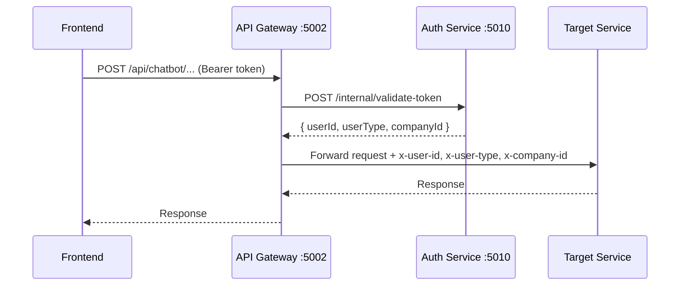
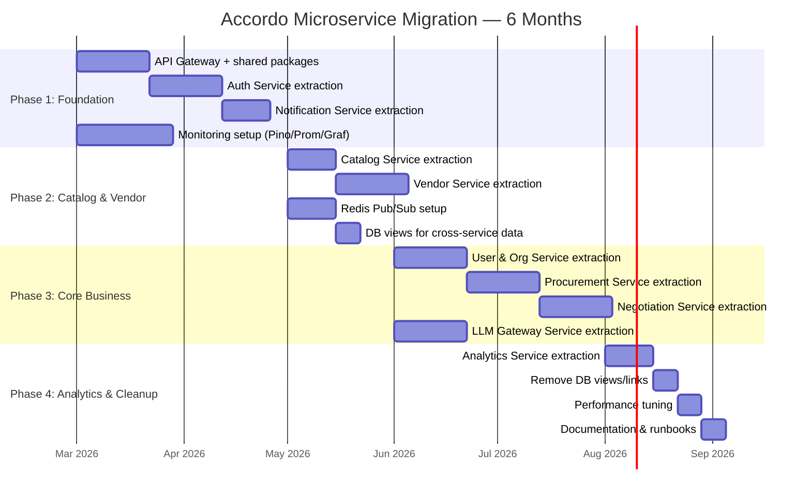

# Accordo Microservice Architecture

> **Status**: Approved — Ready for Phase 1 implementation
> **Last updated**: 2026-03-09
> **Team**: 2 backend devs + 1 DevOps
> **Timeline**: 6 months (aggressive)

---

## Table of Contents

1. [Executive Summary](#1-executive-summary)
2. [Non-Negotiables](#2-non-negotiables)
3. [High-Level Architecture](#3-high-level-architecture)
4. [Service Catalog](#4-service-catalog)
5. [API Gateway](#5-api-gateway)
6. [Inter-Service Communication](#6-inter-service-communication)
7. [Database Strategy](#7-database-strategy)
8. [Shared Packages](#8-shared-packages)
9. [Docker Compose Topology](#9-docker-compose-topology)
10. [Monitoring and Observability](#10-monitoring-and-observability)
11. [CI/CD Pipeline](#11-cicd-pipeline)
12. [Testing Strategy](#12-testing-strategy)
13. [Rollback Strategy](#13-rollback-strategy)
14. [Migration Plan (Strangler Fig)](#14-migration-plan-strangler-fig)
15. [Current-to-Target Route Mapping](#15-current-to-target-route-mapping)
16. [Risk Register](#16-risk-register)

---

## 1. Executive Summary

Accordo is migrating from a monolithic Express backend to a microservice architecture using the **strangler fig pattern**. The monolith (currently running on port 5002) will be incrementally replaced by 10 independent services behind a custom API Gateway, with zero downtime and no breaking changes to existing API contracts.

Key architectural decisions:

| Concern | Decision |
|---------|----------|
| Gateway | Custom Express gateway (JWT validation, header injection) |
| Services | 10 services on ports 5002, 5010-5018 |
| Databases | Database per service (Sequelize in each) |
| Sync comms | HTTP REST between services |
| Async comms | Redis Pub/Sub for events |
| Auth propagation | Gateway validates JWT, injects `x-user-id`/`x-user-type`/`x-company-id` headers |
| Shared code | Internal npm packages in monorepo `packages/` directory |
| Monitoring | Pino + Prometheus + Grafana |
| Service discovery | Docker Compose service names |
| Migration | Strangler fig, 4 phases over 6 months |

---

## 2. Non-Negotiables

These constraints are fixed and apply to every service:

1. **Node.js + TypeScript** for all services (`.js` import extensions, ES Modules)
2. **PostgreSQL** as the database engine
3. **Sequelize** as the ORM (shared migration tooling)
4. **Express.js** as the HTTP framework
5. **Docker / docker-compose** for deployment (profiles: `dev`, `prod`)
6. **Existing API contracts must not break** during migration — the frontend sees the same `/api/*` routes throughout
7. **Zero-downtime migration** via strangler fig pattern

---

## 3. High-Level Architecture

```
                          Frontend (React/Vite :5001)
                                    |
                                    v
                        +-------------------+
                        |   API Gateway     |
                        |   (Express :5002) |
                        |                   |
                        | - JWT validation  |
                        | - Rate limiting   |
                        | - Header injection|
                        | - Request routing |
                        +--------+----------+
                                 |
          +----------+-----------+-----------+----------+
          |          |           |           |          |
          v          v           v           v          v
     +--------+ +--------+ +----------+ +--------+ +--------+
     |  Auth  | |User&Org| |Procuremnt| |Catalog | | Vendor |
     | :5010  | | :5011  | |  :5012   | | :5013  | | :5014  |
     +--------+ +--------+ +----------+ +--------+ +--------+
          |          |           |           |          |
          +----------+-----------+-----------+----------+
                                 |
          +----------+-----------+-----------+
          |          |           |           |
          v          v           v           v
     +--------+ +--------+ +----------+ +----------+
     | Negoti | |  LLM   | |Analytics | |Notificatn|
     | ation  | |Gateway | |  :5017   | |  :5018   |
     | :5015  | | :5016  | +----------+ +----------+
     +--------+ +--------+
                                 |
                    +------------+------------+
                    |            |            |
                    v            v            v
              +---------+  +---------+  +---------+
              |PostgreSQL|  |  Redis  |  | Ollama  |
              | (per-svc)|  |Pub/Sub  |  | / OpenAI|
              +---------+  +---------+  +---------+
```

### Request Flow (Mermaid)



---

## 4. Service Catalog

### Port Allocation

| # | Service | Port | Database | Source Modules (current monolith) |
|---|---------|------|----------|-----------------------------------|
| 1 | API Gateway | 5002 | none | New — routing only |
| 2 | Auth | 5010 | `accordo_auth` | `modules/auth`, `middlewares/jwt.service.ts` |
| 3 | User & Org | 5011 | `accordo_users` | `modules/user`, `modules/company`, `modules/customer`, `modules/role`, `modules/permission` |
| 4 | Procurement | 5012 | `accordo_procurement` | `modules/requisition`, `modules/contract`, `modules/po`, `modules/project`, `modules/bidAnalysis`, `modules/bidComparison` |
| 5 | Catalog | 5013 | `accordo_catalog` | `modules/product` |
| 6 | Vendor | 5014 | `accordo_vendor` | `modules/vendor`, `modules/vendor-chat`, `modules/document` |
| 7 | Negotiation | 5015 | `accordo_negotiation` | `modules/chatbot`, `modules/chat`, `modules/negotiation`, `src/negotiation/`, `src/delivery/` |
| 8 | LLM Gateway | 5016 | `accordo_llm` | `services/llm.service.ts`, `services/openai.service.ts`, `modules/vector`, `src/llm/` |
| 9 | Analytics | 5017 | `accordo_analytics` | `modules/dashboard` |
| 10 | Notification | 5018 | `accordo_notification` | `services/email.service.ts` |

### Service Responsibility Details

#### 1. API Gateway (Port 5002)

The gateway is the single entry point for all frontend traffic. It replaces the monolith at the same port so the frontend requires zero changes.

**Responsibilities:**
- JWT validation (delegates to Auth Service for token verification)
- Injects `x-user-id`, `x-user-type`, `x-company-id` headers into forwarded requests
- Rate limiting (per-IP and per-user)
- Request routing to downstream services
- CORS handling
- Health aggregation

**Explicitly NOT responsible for:**
- Business logic of any kind
- Database access
- Session state

#### 2. Auth Service (Port 5010)

**Owns:** `auth_tokens`, `otps`, `api_usage_logs` tables

**Responsibilities:**
- JWT issuance (access + refresh tokens)
- Token validation endpoint for gateway (`POST /internal/validate-token`)
- Login, signup, password reset flows
- API key/secret validation (for vendor portal programmatic access)
- Refresh token rotation
- OTP generation and verification

**Key interface:**
```typescript
// POST /internal/validate-token
// Request: { token: string }
// Response: { userId: number, userType: string, companyId: number | null, email: string }
```

#### 3. User & Organization Service (Port 5011)

**Owns:** `users`, `companies`, `roles`, `role_permissions`, `preferences`, `user_actions` tables

**Responsibilities:**
- User CRUD, profile management
- Company/organization management
- RBAC: roles, permissions, role assignments
- Customer management
- User settings and preferences

#### 4. Procurement Service (Port 5012)

**Owns:** `requisitions`, `requisition_products`, `requisition_attachments`, `contracts`, `purchase_orders`, `projects`, `project_pocs`, `vendor_bids`, `vendor_selections`, `bid_comparisons`, `bid_action_histories` tables

**Responsibilities:**
- Requisition lifecycle (draft, published, closed)
- Contract and purchase order management
- Project management and POC tracking
- Deal wizard and deal lifecycle
- Bid analysis, comparison, and PDF generation
- Deadline scheduling (cron-based bid comparison deadlines)

#### 5. Catalog Service (Port 5013)

**Owns:** `products` table

**Responsibilities:**
- Product catalog CRUD
- Product categories and attributes
- Product search and filtering

This is the simplest service -- a good early extraction candidate for building team confidence.

#### 6. Vendor Service (Port 5014)

**Owns:** `vendor_companies`, `vendor_notifications`, `vendor_negotiation_profiles` tables

**Responsibilities:**
- Vendor management and onboarding
- Vendor portal (public routes, `uniqueToken`-based auth -- no JWT)
- Vendor profiles and ratings
- Vendor document management
- Vendor notification preferences

**Note:** The vendor portal (`/api/vendor-chat/*`) uses token-based auth, not JWT. The gateway must pass these requests through without JWT validation.

#### 7. Negotiation Service (Port 5015)

**Owns:** `chatbot_deals`, `chatbot_messages`, `chatbot_templates`, `chatbot_template_parameters`, `chat_sessions`, `negotiations`, `negotiation_rounds`, `negotiation_patterns`, `negotiation_training_data`, `meso_rounds` tables

**Responsibilities:**
- Full chatbot negotiation engine (INSIGHTS + CONVERSATION modes)
- Utility scoring and decision engine (`decide.ts`, `weightedUtility.ts`)
- MESO flow management (multi-issue option generation)
- Offer parsing (`parseOffer.ts`) and accumulation (`offerAccumulator.ts`)
- Stall detection and behavioral analysis
- Chat message management
- Negotiation intent pipeline (`buildNegotiationIntent` -> `renderNegotiationMessage`)

**Dependencies:**
- Calls LLM Gateway Service for persona rendering and embeddings
- Calls Vendor Service for vendor profile data
- Calls Procurement Service for requisition context
- Publishes events: `deal.accepted`, `deal.rejected`, `bid.completed`

#### 8. LLM Gateway Service (Port 5016)

**Owns:** `deal_embeddings`, `message_embeddings`, `vector_migration_status` tables

**Responsibilities:**
- Ollama integration (primary LLM provider)
- OpenAI integration (fallback, with auto-failover)
- Prompt management and templates
- Token counting and usage tracking
- Embedding generation (local ONNX / OpenAI / AWS Bedrock)
- Vector/RAG operations and semantic search
- Persona rendering (`personaRenderer.ts`)
- LLM output validation (`validateLlmOutput.ts`)
- Fallback template management

**Key design constraint:** This service is the **only** service that talks to LLMs. All other services call this service's HTTP API.

#### 9. Analytics Service (Port 5017)

**Owns:** Materialized views and aggregation tables (read-heavy, write-light)

**Responsibilities:**
- Dashboard statistics and KPIs
- Negotiation analytics (concession rates, deal velocity, savings)
- Cross-deal learning data aggregation
- Reporting and data exports

**Data source:** Subscribes to Redis events from Negotiation and Procurement services, plus periodic HTTP polling for batch aggregation.

#### 10. Notification Service (Port 5018)

**Owns:** `email_logs` table

**Responsibilities:**
- Email delivery via AWS SES / SMTP (nodemailer)
- Vendor invitation emails
- Contract notification emails
- Template management (email templates)
- Redis Pub/Sub subscriber for async notification triggers

**Key events consumed:**
- `notification.send.email` -- generic email trigger
- `vendor.invited` -- vendor invitation flow
- `deal.accepted` -- deal acceptance notification
- `contract.created` -- contract notification

---

## 5. API Gateway

### Gateway Implementation

The gateway is a lightweight Express server that proxies requests to downstream services. It uses `http-proxy-middleware` for forwarding.

```typescript
// services/gateway/src/index.ts

import express from 'express';
import helmet from 'helmet';
import cors from 'cors';
import { createProxyMiddleware } from 'http-proxy-middleware';
import { validateToken } from './middleware/validateToken.js';
import { injectHeaders } from './middleware/injectHeaders.js';
import { rateLimiter } from './middleware/rateLimiter.js';
import { healthAggregator } from './routes/health.js';
import { logger } from '@accordo/middleware';

const app = express();

app.use(helmet());
app.use(cors({ origin: process.env.CORS_ORIGIN?.split(',') ?? ['http://localhost:5001'] }));
app.use(rateLimiter);

// ---------- Public routes (no JWT) ----------

// Health check
app.use('/api/health', healthAggregator);

// Vendor portal — token-based auth, not JWT
app.use('/api/vendor-chat', createProxyMiddleware({
  target: 'http://vendor:5014',
  pathRewrite: { '^/api/vendor-chat': '/api/vendor-chat' },
}));

// Auth routes (login/signup don't need JWT)
app.use('/api/auth', createProxyMiddleware({
  target: 'http://auth:5010',
  pathRewrite: { '^/api/auth': '/api/auth' },
}));

// ---------- Protected routes (JWT required) ----------

app.use(validateToken);   // calls Auth Service, sets req.user
app.use(injectHeaders);   // sets x-user-id, x-user-type, x-company-id

// Route table
const routes: Record<string, string> = {
  '/api/user':              'http://user-org:5011',
  '/api/customer':          'http://user-org:5011',
  '/api/company':           'http://user-org:5011',
  '/api/role':              'http://user-org:5011',
  '/api/permission':        'http://user-org:5011',
  '/api/requisition':       'http://procurement:5012',
  '/api/contract':          'http://procurement:5012',
  '/api/po':                'http://procurement:5012',
  '/api/project':           'http://procurement:5012',
  '/api/bid-analysis':      'http://procurement:5012',
  '/api/bid-comparison':    'http://procurement:5012',
  '/api/product':           'http://catalog:5013',
  '/api/vendor-management': 'http://vendor:5014',
  '/api/vendor':            'http://vendor:5014',
  '/api/document':          'http://vendor:5014',
  '/api/chatbot':           'http://negotiation:5015',
  '/api/chat':              'http://negotiation:5015',
  '/api/negotiation':       'http://negotiation:5015',
  '/api/vector':            'http://llm-gateway:5016',
  '/api/dashboard':         'http://analytics:5017',
};

for (const [path, target] of Object.entries(routes)) {
  app.use(path, createProxyMiddleware({ target, pathRewrite: { [`^${path}`]: path } }));
}

app.listen(5002, () => logger.info('API Gateway listening on :5002'));
```

### Gateway Middleware: Token Validation

```typescript
// services/gateway/src/middleware/validateToken.ts

import type { Request, Response, NextFunction } from 'express';

export async function validateToken(req: Request, res: Response, next: NextFunction) {
  const authHeader = req.headers.authorization;
  if (!authHeader?.startsWith('Bearer ')) {
    return res.status(401).json({ error: 'Missing or invalid Authorization header' });
  }

  const token = authHeader.slice(7);

  try {
    const response = await fetch('http://auth:5010/internal/validate-token', {
      method: 'POST',
      headers: { 'Content-Type': 'application/json' },
      body: JSON.stringify({ token }),
    });

    if (!response.ok) {
      return res.status(401).json({ error: 'Invalid or expired token' });
    }

    const user = await response.json();
    // Attach to request for injectHeaders middleware
    (req as any).validatedUser = user;
    next();
  } catch (err) {
    return res.status(503).json({ error: 'Auth service unavailable' });
  }
}
```

### Gateway Middleware: Header Injection

```typescript
// services/gateway/src/middleware/injectHeaders.ts

import type { Request, Response, NextFunction } from 'express';

export function injectHeaders(req: Request, _res: Response, next: NextFunction) {
  const user = (req as any).validatedUser;
  if (user) {
    req.headers['x-user-id'] = String(user.userId);
    req.headers['x-user-type'] = user.userType;
    req.headers['x-company-id'] = user.companyId ? String(user.companyId) : '';
  }
  next();
}
```

### Downstream Service: Extracting User Context

Every downstream service uses shared middleware from `@accordo/middleware` to extract the injected headers:

```typescript
// packages/middleware/src/extractUser.ts

import type { Request, Response, NextFunction } from 'express';

export function extractUser(req: Request, _res: Response, next: NextFunction) {
  req.context = {
    userId: parseInt(req.headers['x-user-id'] as string, 10),
    userType: req.headers['x-user-type'] as 'admin' | 'customer' | 'vendor',
    companyId: req.headers['x-company-id']
      ? parseInt(req.headers['x-company-id'] as string, 10)
      : undefined,
  };
  next();
}
```

---

## 6. Inter-Service Communication

### Synchronous: HTTP REST

Used for **queries** and **request-response** operations where the caller needs an immediate answer.

```
Negotiation Service                    LLM Gateway Service
       |                                      |
       |  POST /api/llm/render-persona        |
       |  { intent, vendorMessage, context }  |
       |------------------------------------->|
       |                                      |
       |  200 { message: "..." }              |
       |<-------------------------------------|
```

**Conventions:**
- Internal endpoints live under `/internal/*` and are not exposed through the gateway
- Retry with exponential backoff: 3 attempts, base delay 500ms, max delay 4s
- Circuit breaker per downstream service (open after 5 consecutive failures, half-open after 30s)
- Timeout: 10s for standard calls, 60s for LLM calls

```typescript
// packages/utils/src/serviceClient.ts

import pRetry from 'p-retry';

export function createServiceClient(baseUrl: string, timeoutMs = 10_000) {
  return {
    async get<T>(path: string): Promise<T> {
      return pRetry(
        async () => {
          const res = await fetch(`${baseUrl}${path}`, {
            signal: AbortSignal.timeout(timeoutMs),
            headers: { 'Content-Type': 'application/json' },
          });
          if (!res.ok) throw new Error(`${res.status} ${res.statusText}`);
          return res.json() as T;
        },
        { retries: 3, minTimeout: 500, maxTimeout: 4000 },
      );
    },

    async post<T>(path: string, body: unknown): Promise<T> {
      return pRetry(
        async () => {
          const res = await fetch(`${baseUrl}${path}`, {
            method: 'POST',
            signal: AbortSignal.timeout(timeoutMs),
            headers: { 'Content-Type': 'application/json' },
            body: JSON.stringify(body),
          });
          if (!res.ok) throw new Error(`${res.status} ${res.statusText}`);
          return res.json() as T;
        },
        { retries: 3, minTimeout: 500, maxTimeout: 4000 },
      );
    },
  };
}
```

### Asynchronous: Redis Pub/Sub

Used for **fire-and-forget events** where the publisher does not need a response.

```
Negotiation Service        Redis Pub/Sub         Notification Service
       |                        |                        |
       | PUBLISH deal.accepted  |                        |
       |  { dealId, vendorId }  |                        |
       |----------------------->|                        |
       |                        | deliver to subscriber  |
       |                        |----------------------->|
       |                        |                        |
       |                        |   Analytics Service    |
       |                        |----------------------->|
```

**Event catalog:**

| Event | Publisher | Subscribers | Payload |
|-------|-----------|-------------|---------|
| `deal.accepted` | Negotiation | Notification, Analytics | `{ dealId, vendorId, agreedPrice, companyId }` |
| `deal.rejected` | Negotiation | Analytics | `{ dealId, vendorId, reason }` |
| `bid.completed` | Procurement | Notification, Analytics | `{ requisitionId, vendorId, bidAmount }` |
| `vendor.invited` | Vendor | Notification | `{ vendorId, email, requisitionId, token }` |
| `contract.created` | Procurement | Notification | `{ contractId, vendorId, companyId }` |
| `user.created` | User & Org | Notification | `{ userId, email, companyId }` |
| `notification.send.email` | Any service | Notification | `{ to, subject, template, data }` |

**Redis Pub/Sub implementation:**

```typescript
// packages/utils/src/events/publisher.ts

import { createClient } from 'redis';
import { logger } from '@accordo/middleware';

let client: ReturnType<typeof createClient>;

export async function initPublisher() {
  client = createClient({ url: process.env.REDIS_URL ?? 'redis://redis:6379' });
  await client.connect();
  logger.info('Redis publisher connected');
}

export async function publishEvent(channel: string, payload: Record<string, unknown>) {
  await client.publish(channel, JSON.stringify({
    event: channel,
    timestamp: new Date().toISOString(),
    data: payload,
  }));
}
```

```typescript
// packages/utils/src/events/subscriber.ts

import { createClient } from 'redis';
import { logger } from '@accordo/middleware';

type Handler = (data: Record<string, unknown>) => Promise<void>;

export async function subscribe(channels: string[], handler: Handler) {
  const client = createClient({ url: process.env.REDIS_URL ?? 'redis://redis:6379' });
  await client.connect();

  for (const channel of channels) {
    await client.subscribe(channel, async (message) => {
      try {
        const parsed = JSON.parse(message);
        await handler(parsed.data);
      } catch (err) {
        logger.error({ err, channel }, 'Failed to process event');
      }
    });
  }

  logger.info({ channels }, 'Subscribed to Redis channels');
}
```

---

## 7. Database Strategy

### Database per Service

Each service owns its own PostgreSQL database. No service directly queries another service's database.

```
PostgreSQL Server
  |
  +-- accordo_auth           (Auth Service)
  +-- accordo_users          (User & Org Service)
  +-- accordo_procurement    (Procurement Service)
  +-- accordo_catalog        (Catalog Service)
  +-- accordo_vendor         (Vendor Service)
  +-- accordo_negotiation    (Negotiation Service)
  +-- accordo_llm            (LLM Gateway Service)
  +-- accordo_analytics      (Analytics Service)
  +-- accordo_notification   (Notification Service)
  +-- accordo                (Legacy monolith — shrinks over time)
```

### Migration Period: DB Views and Links

During the strangler fig migration, some services will need data that has not yet been extracted. We use **read-only PostgreSQL views** in the legacy database that point to the new service databases, and vice versa.

```sql
-- In the legacy 'accordo' database, create a foreign server link
-- to the newly extracted 'accordo_auth' database
CREATE EXTENSION IF NOT EXISTS postgres_fdw;

CREATE SERVER auth_server
  FOREIGN DATA WRAPPER postgres_fdw
  OPTIONS (host 'localhost', dbname 'accordo_auth', port '5432');

CREATE USER MAPPING FOR postgres
  SERVER auth_server
  OPTIONS (user 'postgres', password 'postgres');

-- Create a foreign table that mirrors the auth_tokens table
CREATE FOREIGN TABLE legacy_auth_tokens (
  id INTEGER,
  user_id INTEGER,
  token TEXT,
  expires_at TIMESTAMPTZ
) SERVER auth_server OPTIONS (table_name 'auth_tokens');
```

**Rules:**
- Foreign tables are **read-only** from the consumer side
- All writes go through the owning service's HTTP API
- Foreign tables are removed at the end of each migration phase (clean cut)
- Each phase ends with a verification that no cross-DB queries remain

### Shared Migration Tooling

All services use Sequelize CLI with the same configuration pattern:

```javascript
// services/<name>/sequelize.config.cjs
// Each service has its own config pointing to its own database

const path = require('path');

module.exports = {
  development: {
    username: process.env.DB_USERNAME || 'postgres',
    password: process.env.DB_PASSWORD || 'postgres',
    database: process.env.DB_NAME || 'accordo_<service>',
    host: process.env.DB_HOST || 'postgres',
    port: parseInt(process.env.DB_PORT || '5432'),
    dialect: 'postgres',
    migrationStoragePath: path.resolve(__dirname, 'migrations'),
  },
  production: {
    // ...same structure, no defaults
  },
};
```

---

## 8. Shared Packages

Shared code lives in the monorepo `packages/` directory and is published as internal npm packages using npm workspaces.

### Repository Structure

```
Accordo-ai-backend/
  package.json              # Root workspace config
  packages/
    types/
      package.json          # @accordo/types
      src/
        index.ts
        user.ts             # UserContext, UserType, etc.
        negotiation.ts      # NegotiationIntent, Decision, etc.
        events.ts           # Event payload types
        api.ts              # Shared API response types
    middleware/
      package.json          # @accordo/middleware
      src/
        index.ts
        extractUser.ts      # x-user-* header extraction
        errorHandler.ts     # Standard error response format
        requestLogger.ts    # Pino request logging
        healthCheck.ts      # /health endpoint factory
    utils/
      package.json          # @accordo/utils
      src/
        index.ts
        serviceClient.ts    # HTTP client with retry
        events/
          publisher.ts      # Redis Pub/Sub publisher
          subscriber.ts     # Redis Pub/Sub subscriber
        currency.ts         # Currency conversion
        validation.ts       # Common validators
  services/
    gateway/                # API Gateway (port 5002)
    auth/                   # Auth Service (port 5010)
    user-org/               # User & Org Service (port 5011)
    procurement/            # Procurement Service (port 5012)
    catalog/                # Catalog Service (port 5013)
    vendor/                 # Vendor Service (port 5014)
    negotiation/            # Negotiation Service (port 5015)
    llm-gateway/            # LLM Gateway Service (port 5016)
    analytics/              # Analytics Service (port 5017)
    notification/           # Notification Service (port 5018)
```

### Root Workspace Configuration

```json
{
  "name": "accordo-backend",
  "private": true,
  "workspaces": [
    "packages/*",
    "services/*"
  ]
}
```

### Package: @accordo/types

```typescript
// packages/types/src/user.ts

export type UserType = 'admin' | 'customer' | 'vendor';

export interface UserContext {
  userId: number;
  userType: UserType;
  companyId?: number;
  email?: string;
}

// Augment Express Request
declare global {
  namespace Express {
    interface Request {
      context: UserContext;
    }
  }
}
```

```typescript
// packages/types/src/events.ts

export interface DealAcceptedEvent {
  dealId: number;
  vendorId: number;
  agreedPrice: number;
  companyId: number;
}

export interface VendorInvitedEvent {
  vendorId: number;
  email: string;
  requisitionId: number;
  token: string;
}

export interface NotificationEvent {
  to: string;
  subject: string;
  template: string;
  data: Record<string, unknown>;
}
```

### Package: @accordo/middleware

```typescript
// packages/middleware/src/healthCheck.ts

import type { Router } from 'express';
import { Sequelize } from 'sequelize';

export function registerHealthCheck(router: Router, serviceName: string, sequelize?: Sequelize) {
  router.get('/health', async (_req, res) => {
    const status: Record<string, string> = { service: 'ok' };

    if (sequelize) {
      try {
        await sequelize.authenticate();
        status.database = 'ok';
      } catch {
        status.database = 'error';
        return res.status(503).json({ service: serviceName, ...status });
      }
    }

    res.json({ service: serviceName, ...status, uptime: process.uptime() });
  });
}
```

---

## 9. Docker Compose Topology

### Target docker-compose.yml (Microservices)

```yaml
# docker-compose.yml — Accordo Microservices

services:
  # ────────────── Infrastructure ──────────────

  postgres:
    image: postgres:17-alpine
    container_name: accordo-postgres
    environment:
      POSTGRES_USER: ${DB_USERNAME:-postgres}
      POSTGRES_PASSWORD: ${DB_PASSWORD:-postgres}
    ports:
      - "5432:5432"
    volumes:
      - postgres_data:/var/lib/postgresql/data
      - ./scripts/init-databases.sql:/docker-entrypoint-initdb.d/init.sql
    healthcheck:
      test: ["CMD-SHELL", "pg_isready -U postgres"]
      interval: 10s
      timeout: 5s
      retries: 5
    restart: unless-stopped

  redis:
    image: redis:7-alpine
    container_name: accordo-redis
    ports:
      - "6379:6379"
    volumes:
      - redis_data:/data
    healthcheck:
      test: ["CMD", "redis-cli", "ping"]
      interval: 10s
      timeout: 5s
      retries: 5
    restart: unless-stopped

  # ────────────── Monitoring ──────────────

  prometheus:
    image: prom/prometheus:latest
    container_name: accordo-prometheus
    volumes:
      - ./monitoring/prometheus.yml:/etc/prometheus/prometheus.yml
    ports:
      - "9090:9090"
    restart: unless-stopped

  grafana:
    image: grafana/grafana:latest
    container_name: accordo-grafana
    ports:
      - "3000:3000"
    volumes:
      - grafana_data:/var/lib/grafana
    depends_on:
      - prometheus
    restart: unless-stopped

  # ────────────── API Gateway ──────────────

  gateway:
    build:
      context: .
      dockerfile: services/gateway/Dockerfile
    container_name: accordo-gateway
    ports:
      - "5002:5002"
    environment:
      PORT: 5002
      AUTH_SERVICE_URL: http://auth:5010
      CORS_ORIGIN: ${CORS_ORIGIN:-http://localhost:5001}
      REDIS_URL: redis://redis:6379
    depends_on:
      auth:
        condition: service_healthy
    restart: unless-stopped

  # ────────────── Application Services ──────────────

  auth:
    build:
      context: .
      dockerfile: services/auth/Dockerfile
    container_name: accordo-auth
    environment:
      PORT: 5010
      DB_HOST: postgres
      DB_NAME: accordo_auth
      DB_USERNAME: ${DB_USERNAME:-postgres}
      DB_PASSWORD: ${DB_PASSWORD:-postgres}
      JWT_SECRET: ${JWT_SECRET}
      JWT_ACCESS_TOKEN_SECRET: ${JWT_ACCESS_TOKEN_SECRET}
      JWT_REFRESH_TOKEN_SECRET: ${JWT_REFRESH_TOKEN_SECRET}
      JWT_ACCESS_EXPIRY: ${JWT_ACCESS_EXPIRY:-1h}
      JWT_REFRESH_EXPIRY: ${JWT_REFRESH_EXPIRY:-7d}
      REDIS_URL: redis://redis:6379
    depends_on:
      postgres:
        condition: service_healthy
    healthcheck:
      test: ["CMD", "curl", "-f", "http://localhost:5010/health"]
      interval: 15s
      timeout: 5s
      retries: 3
    restart: unless-stopped

  user-org:
    build:
      context: .
      dockerfile: services/user-org/Dockerfile
    container_name: accordo-user-org
    environment:
      PORT: 5011
      DB_HOST: postgres
      DB_NAME: accordo_users
      DB_USERNAME: ${DB_USERNAME:-postgres}
      DB_PASSWORD: ${DB_PASSWORD:-postgres}
      REDIS_URL: redis://redis:6379
    depends_on:
      postgres:
        condition: service_healthy
    healthcheck:
      test: ["CMD", "curl", "-f", "http://localhost:5011/health"]
      interval: 15s
      timeout: 5s
      retries: 3
    restart: unless-stopped

  procurement:
    build:
      context: .
      dockerfile: services/procurement/Dockerfile
    container_name: accordo-procurement
    environment:
      PORT: 5012
      DB_HOST: postgres
      DB_NAME: accordo_procurement
      DB_USERNAME: ${DB_USERNAME:-postgres}
      DB_PASSWORD: ${DB_PASSWORD:-postgres}
      VENDOR_SERVICE_URL: http://vendor:5014
      NOTIFICATION_SERVICE_URL: http://notification:5018
      REDIS_URL: redis://redis:6379
    depends_on:
      postgres:
        condition: service_healthy
    healthcheck:
      test: ["CMD", "curl", "-f", "http://localhost:5012/health"]
      interval: 15s
      timeout: 5s
      retries: 3
    restart: unless-stopped

  catalog:
    build:
      context: .
      dockerfile: services/catalog/Dockerfile
    container_name: accordo-catalog
    environment:
      PORT: 5013
      DB_HOST: postgres
      DB_NAME: accordo_catalog
      DB_USERNAME: ${DB_USERNAME:-postgres}
      DB_PASSWORD: ${DB_PASSWORD:-postgres}
      REDIS_URL: redis://redis:6379
    depends_on:
      postgres:
        condition: service_healthy
    healthcheck:
      test: ["CMD", "curl", "-f", "http://localhost:5013/health"]
      interval: 15s
      timeout: 5s
      retries: 3
    restart: unless-stopped

  vendor:
    build:
      context: .
      dockerfile: services/vendor/Dockerfile
    container_name: accordo-vendor
    environment:
      PORT: 5014
      DB_HOST: postgres
      DB_NAME: accordo_vendor
      DB_USERNAME: ${DB_USERNAME:-postgres}
      DB_PASSWORD: ${DB_PASSWORD:-postgres}
      VENDOR_PORTAL_URL: ${VENDOR_PORTAL_URL:-http://localhost:5001/vendor}
      REDIS_URL: redis://redis:6379
    depends_on:
      postgres:
        condition: service_healthy
    healthcheck:
      test: ["CMD", "curl", "-f", "http://localhost:5014/health"]
      interval: 15s
      timeout: 5s
      retries: 3
    restart: unless-stopped

  negotiation:
    build:
      context: .
      dockerfile: services/negotiation/Dockerfile
    container_name: accordo-negotiation
    environment:
      PORT: 5015
      DB_HOST: postgres
      DB_NAME: accordo_negotiation
      DB_USERNAME: ${DB_USERNAME:-postgres}
      DB_PASSWORD: ${DB_PASSWORD:-postgres}
      LLM_GATEWAY_URL: http://llm-gateway:5016
      VENDOR_SERVICE_URL: http://vendor:5014
      PROCUREMENT_SERVICE_URL: http://procurement:5012
      REDIS_URL: redis://redis:6379
    depends_on:
      postgres:
        condition: service_healthy
      llm-gateway:
        condition: service_healthy
    healthcheck:
      test: ["CMD", "curl", "-f", "http://localhost:5015/health"]
      interval: 15s
      timeout: 5s
      retries: 3
    restart: unless-stopped

  llm-gateway:
    build:
      context: .
      dockerfile: services/llm-gateway/Dockerfile
    container_name: accordo-llm-gateway
    environment:
      PORT: 5016
      DB_HOST: postgres
      DB_NAME: accordo_llm
      DB_USERNAME: ${DB_USERNAME:-postgres}
      DB_PASSWORD: ${DB_PASSWORD:-postgres}
      LLM_BASE_URL: ${LLM_BASE_URL:-http://host.docker.internal:11434}
      LLM_MODEL: ${LLM_MODEL:-qwen3}
      LLM_TIMEOUT: ${LLM_TIMEOUT:-60000}
      OPENAI_API_KEY: ${OPENAI_API_KEY:-}
      OPENAI_MODEL: ${OPENAI_MODEL:-}
      EMBEDDING_PROVIDER: ${EMBEDDING_PROVIDER:-local}
      REDIS_URL: redis://redis:6379
    depends_on:
      postgres:
        condition: service_healthy
    healthcheck:
      test: ["CMD", "curl", "-f", "http://localhost:5016/health"]
      interval: 15s
      timeout: 5s
      retries: 3
    restart: unless-stopped

  analytics:
    build:
      context: .
      dockerfile: services/analytics/Dockerfile
    container_name: accordo-analytics
    environment:
      PORT: 5017
      DB_HOST: postgres
      DB_NAME: accordo_analytics
      DB_USERNAME: ${DB_USERNAME:-postgres}
      DB_PASSWORD: ${DB_PASSWORD:-postgres}
      PROCUREMENT_SERVICE_URL: http://procurement:5012
      NEGOTIATION_SERVICE_URL: http://negotiation:5015
      REDIS_URL: redis://redis:6379
    depends_on:
      postgres:
        condition: service_healthy
    healthcheck:
      test: ["CMD", "curl", "-f", "http://localhost:5017/health"]
      interval: 15s
      timeout: 5s
      retries: 3
    restart: unless-stopped

  notification:
    build:
      context: .
      dockerfile: services/notification/Dockerfile
    container_name: accordo-notification
    environment:
      PORT: 5018
      DB_HOST: postgres
      DB_NAME: accordo_notification
      DB_USERNAME: ${DB_USERNAME:-postgres}
      DB_PASSWORD: ${DB_PASSWORD:-postgres}
      EMAIL_PROVIDER: ${EMAIL_PROVIDER:-nodemailer}
      SMTP_HOST: ${SMTP_HOST:-}
      SMTP_PORT: ${SMTP_PORT:-}
      SMTP_USER: ${SMTP_USER:-}
      SMTP_PASS: ${SMTP_PASS:-}
      SMTP_FROM_EMAIL: ${SMTP_FROM_EMAIL:-}
      REDIS_URL: redis://redis:6379
    depends_on:
      postgres:
        condition: service_healthy
      redis:
        condition: service_healthy
    healthcheck:
      test: ["CMD", "curl", "-f", "http://localhost:5018/health"]
      interval: 15s
      timeout: 5s
      retries: 3
    restart: unless-stopped

volumes:
  postgres_data:
  redis_data:
  grafana_data:
```

### Database Initialization Script

```sql
-- scripts/init-databases.sql
-- Runs once when the PostgreSQL container is first created

CREATE DATABASE accordo_auth;
CREATE DATABASE accordo_users;
CREATE DATABASE accordo_procurement;
CREATE DATABASE accordo_catalog;
CREATE DATABASE accordo_vendor;
CREATE DATABASE accordo_negotiation;
CREATE DATABASE accordo_llm;
CREATE DATABASE accordo_analytics;
CREATE DATABASE accordo_notification;
```

### Service Dockerfile Template

Each service uses the same multi-stage Dockerfile pattern:

```dockerfile
# services/<name>/Dockerfile

FROM node:20-alpine AS base
WORKDIR /app

# Install workspace dependencies
COPY package.json package-lock.json ./
COPY packages/types/package.json packages/types/
COPY packages/middleware/package.json packages/middleware/
COPY packages/utils/package.json packages/utils/
COPY services/<name>/package.json services/<name>/
RUN npm ci --workspace=packages/types \
           --workspace=packages/middleware \
           --workspace=packages/utils \
           --workspace=services/<name>

# Build shared packages
COPY packages/ packages/
RUN npm run build --workspace=packages/types \
 && npm run build --workspace=packages/middleware \
 && npm run build --workspace=packages/utils

# Build service
COPY services/<name>/ services/<name>/
RUN npm run build --workspace=services/<name>

# Production image
FROM node:20-alpine AS prod
WORKDIR /app
COPY --from=base /app/node_modules ./node_modules
COPY --from=base /app/packages/types/dist ./packages/types/dist
COPY --from=base /app/packages/types/package.json ./packages/types/
COPY --from=base /app/packages/middleware/dist ./packages/middleware/dist
COPY --from=base /app/packages/middleware/package.json ./packages/middleware/
COPY --from=base /app/packages/utils/dist ./packages/utils/dist
COPY --from=base /app/packages/utils/package.json ./packages/utils/
COPY --from=base /app/services/<name>/dist ./services/<name>/dist
COPY --from=base /app/services/<name>/package.json ./services/<name>/
COPY --from=base /app/services/<name>/migrations ./services/<name>/migrations

EXPOSE <port>
CMD ["node", "services/<name>/dist/index.js"]
```

---

## 10. Monitoring and Observability

### Pino Structured Logging

All services use Pino for JSON-formatted structured logs, configured via `@accordo/middleware`.

```typescript
// packages/middleware/src/logger.ts

import pino from 'pino';

export const logger = pino({
  level: process.env.LOG_LEVEL ?? 'info',
  formatters: {
    level(label) { return { level: label }; },
  },
  timestamp: pino.stdTimeFunctions.isoTime,
  base: {
    service: process.env.SERVICE_NAME ?? 'unknown',
    env: process.env.NODE_ENV ?? 'development',
  },
});
```

**Log output example:**
```json
{
  "level": "info",
  "time": "2026-03-09T14:30:00.000Z",
  "service": "negotiation",
  "env": "production",
  "msg": "Deal accepted",
  "dealId": 42,
  "vendorId": 7,
  "agreedPrice": 125000,
  "responseTimeMs": 234
}
```

### Prometheus Metrics

Each service exposes a `/metrics` endpoint for Prometheus scraping.

```typescript
// packages/middleware/src/metrics.ts

import { collectDefaultMetrics, Registry, Histogram, Counter } from 'prom-client';

const register = new Registry();
collectDefaultMetrics({ register });

export const httpRequestDuration = new Histogram({
  name: 'http_request_duration_seconds',
  help: 'Duration of HTTP requests in seconds',
  labelNames: ['method', 'route', 'status_code', 'service'],
  buckets: [0.01, 0.05, 0.1, 0.25, 0.5, 1, 2.5, 5, 10],
  registers: [register],
});

export const httpRequestTotal = new Counter({
  name: 'http_requests_total',
  help: 'Total number of HTTP requests',
  labelNames: ['method', 'route', 'status_code', 'service'],
  registers: [register],
});

export { register };
```

### Prometheus Configuration

```yaml
# monitoring/prometheus.yml

global:
  scrape_interval: 15s

scrape_configs:
  - job_name: 'gateway'
    static_configs:
      - targets: ['gateway:5002']
    metrics_path: /metrics

  - job_name: 'auth'
    static_configs:
      - targets: ['auth:5010']
    metrics_path: /metrics

  - job_name: 'user-org'
    static_configs:
      - targets: ['user-org:5011']
    metrics_path: /metrics

  - job_name: 'procurement'
    static_configs:
      - targets: ['procurement:5012']
    metrics_path: /metrics

  - job_name: 'catalog'
    static_configs:
      - targets: ['catalog:5013']
    metrics_path: /metrics

  - job_name: 'vendor'
    static_configs:
      - targets: ['vendor:5014']
    metrics_path: /metrics

  - job_name: 'negotiation'
    static_configs:
      - targets: ['negotiation:5015']
    metrics_path: /metrics

  - job_name: 'llm-gateway'
    static_configs:
      - targets: ['llm-gateway:5016']
    metrics_path: /metrics

  - job_name: 'analytics'
    static_configs:
      - targets: ['analytics:5017']
    metrics_path: /metrics

  - job_name: 'notification'
    static_configs:
      - targets: ['notification:5018']
    metrics_path: /metrics
```

### Key Grafana Dashboards

| Dashboard | Panels |
|-----------|--------|
| Service Overview | Request rate, error rate, p50/p95/p99 latency per service |
| Gateway | Route-level latency, upstream error rates, rate limit hits |
| Negotiation | Active deals, messages/min, LLM call latency, stall detection rate |
| LLM Gateway | Ollama/OpenAI latency, fallback rate, token usage, embedding throughput |
| Database | Connection pool utilization, query duration, migration status |

### Health Checks

Every service exposes a health endpoint used by Docker healthcheck and the gateway's health aggregator:

```
GET /health

200 OK
{
  "service": "negotiation",
  "service": "ok",
  "database": "ok",
  "uptime": 3600.5
}

503 Service Unavailable
{
  "service": "negotiation",
  "service": "ok",
  "database": "error"
}
```

---

## 11. CI/CD Pipeline

### GitHub Actions: Service-Level Build Triggers

Each service is built and deployed independently. Changes to shared packages trigger rebuilds of all dependent services.

```yaml
# .github/workflows/ci.yml

name: CI

on:
  push:
    branches: [main, develop]
  pull_request:
    branches: [main]

jobs:
  detect-changes:
    runs-on: ubuntu-latest
    outputs:
      packages: ${{ steps.changes.outputs.packages }}
      gateway: ${{ steps.changes.outputs.gateway }}
      auth: ${{ steps.changes.outputs.auth }}
      user-org: ${{ steps.changes.outputs.user-org }}
      procurement: ${{ steps.changes.outputs.procurement }}
      catalog: ${{ steps.changes.outputs.catalog }}
      vendor: ${{ steps.changes.outputs.vendor }}
      negotiation: ${{ steps.changes.outputs.negotiation }}
      llm-gateway: ${{ steps.changes.outputs.llm-gateway }}
      analytics: ${{ steps.changes.outputs.analytics }}
      notification: ${{ steps.changes.outputs.notification }}
    steps:
      - uses: actions/checkout@v4
      - uses: dorny/paths-filter@v3
        id: changes
        with:
          filters: |
            packages:
              - 'packages/**'
            gateway:
              - 'services/gateway/**'
            auth:
              - 'services/auth/**'
            user-org:
              - 'services/user-org/**'
            procurement:
              - 'services/procurement/**'
            catalog:
              - 'services/catalog/**'
            vendor:
              - 'services/vendor/**'
            negotiation:
              - 'services/negotiation/**'
            llm-gateway:
              - 'services/llm-gateway/**'
            analytics:
              - 'services/analytics/**'
            notification:
              - 'services/notification/**'

  test-packages:
    needs: detect-changes
    if: needs.detect-changes.outputs.packages == 'true'
    runs-on: ubuntu-latest
    steps:
      - uses: actions/checkout@v4
      - uses: actions/setup-node@v4
        with:
          node-version: 20
          cache: npm
      - run: npm ci
      - run: npm run type-check --workspace=packages/types
      - run: npm run type-check --workspace=packages/middleware
      - run: npm run type-check --workspace=packages/utils
      - run: npm test --workspace=packages/types
      - run: npm test --workspace=packages/middleware
      - run: npm test --workspace=packages/utils

  # Template for each service — shown once, repeated per service
  test-auth:
    needs: detect-changes
    if: >
      needs.detect-changes.outputs.auth == 'true' ||
      needs.detect-changes.outputs.packages == 'true'
    runs-on: ubuntu-latest
    services:
      postgres:
        image: postgres:17-alpine
        env:
          POSTGRES_DB: accordo_auth_test
          POSTGRES_USER: postgres
          POSTGRES_PASSWORD: postgres
        ports:
          - 5432:5432
        options: >-
          --health-cmd "pg_isready -U postgres"
          --health-interval 10s
          --health-timeout 5s
          --health-retries 5
    steps:
      - uses: actions/checkout@v4
      - uses: actions/setup-node@v4
        with:
          node-version: 20
          cache: npm
      - run: npm ci
      - run: npm run build --workspace=packages/types
      - run: npm run build --workspace=packages/middleware
      - run: npm run build --workspace=packages/utils
      - run: npm run test:unit --workspace=services/auth
      - run: npm run test:integration --workspace=services/auth
        env:
          DB_HOST: localhost
          DB_NAME: accordo_auth_test

  # Contract tests (Pact)
  contract-tests:
    needs: detect-changes
    if: >
      needs.detect-changes.outputs.gateway == 'true' ||
      needs.detect-changes.outputs.auth == 'true' ||
      needs.detect-changes.outputs.negotiation == 'true' ||
      needs.detect-changes.outputs.packages == 'true'
    runs-on: ubuntu-latest
    steps:
      - uses: actions/checkout@v4
      - uses: actions/setup-node@v4
        with:
          node-version: 20
          cache: npm
      - run: npm ci
      - run: npm run build --workspaces
      - run: npm run test:contract
```

---

## 12. Testing Strategy

### Three Testing Layers

```
+──────────────────────────────────────+
|         Contract Tests (Pact)        |  Service boundaries
+──────────────────────────────────────+
|        Integration Tests             |  Service + DB
+──────────────────────────────────────+
|           Unit Tests                 |  Pure logic
+──────────────────────────────────────+
```

### Unit Tests

Each service has unit tests that run without a database. These cover business logic, validation, and utility functions.

```bash
npm run test:unit --workspace=services/negotiation
```

### Integration Tests

Service-level integration tests that spin up the service with a test database.

```bash
npm run test:integration --workspace=services/auth
```

### Contract Tests (Pact)

Contract tests verify that service-to-service HTTP interfaces are compatible. The **consumer** defines the expected request/response, and the **provider** verifies it can fulfill that contract.

```
Consumer (Negotiation)              Provider (LLM Gateway)
     |                                    |
     |  "I expect POST /api/llm/render    |
     |   with this body to return 200     |
     |   with { message: string }"        |
     |                                    |
     |  ← Pact contract file →           |
     |                                    |
     |              Pact verifies provider matches contract
```

**Key contracts to test:**
- Gateway -> Auth (token validation)
- Negotiation -> LLM Gateway (persona rendering, embeddings)
- Negotiation -> Vendor (vendor profile lookup)
- Negotiation -> Procurement (requisition context)
- Any service -> Notification (event payloads)

---

## 13. Rollback Strategy

### Feature Flags

Feature flags control which code path is active -- monolith route or microservice route. This allows instant rollback without redeployment.

```typescript
// services/gateway/src/middleware/featureFlags.ts

// During migration, the gateway can route to either the monolith or the new service
// based on feature flags stored in Redis

interface FeatureFlag {
  service: string;
  enabled: boolean;     // true = route to new service, false = route to monolith
}

export async function getRouteTarget(path: string): Promise<string> {
  const flag = await redis.get(`feature:route:${path}`);

  if (flag === 'microservice') {
    return serviceRoutes[path];   // e.g., http://auth:5010
  }

  return 'http://monolith:5002';  // fallback to monolith
}
```

### Blue/Green per Service

Each service can be deployed independently using blue/green:

1. Deploy new version as "green" container alongside existing "blue"
2. Run health checks against green
3. Switch gateway routing from blue to green
4. Keep blue running for 15 minutes as fallback
5. Tear down blue

In Docker Compose, this is achieved by running both versions simultaneously with different container names and updating the gateway's upstream target.

---

## 14. Migration Plan (Strangler Fig)

### Overview



### Phase 1: Foundation (Month 1-2)

**Goal:** Establish the gateway, shared packages, and extract the two simplest services.

**Step-by-step:**

1. **Create monorepo structure** — set up `packages/` and `services/` directories, configure npm workspaces
2. **Build shared packages** — `@accordo/types`, `@accordo/middleware`, `@accordo/utils`
3. **Build API Gateway** — Express server on port 5002 with JWT validation and proxy routing
4. **Extract Auth Service** — move `modules/auth` and `middlewares/jwt.service.ts` to `services/auth`
   - Create `accordo_auth` database
   - Migrate `auth_tokens`, `otps` tables
   - Add `/internal/validate-token` endpoint for gateway
   - Feature flag: gateway routes `/api/auth/*` to new service
   - Verify: login, signup, token refresh all work through gateway
5. **Extract Notification Service** — move `services/email.service.ts` to `services/notification`
   - Create `accordo_notification` database
   - Migrate `email_logs` table
   - Set up Redis Pub/Sub subscriber
   - Feature flag: monolith publishes events instead of calling email service directly
6. **Set up monitoring** — Pino in all services, Prometheus scraping, Grafana dashboards

**Validation criteria for Phase 1:**
- [ ] Frontend login/signup works unchanged
- [ ] All existing API tests pass through the gateway
- [ ] Email notifications still arrive
- [ ] Prometheus shows metrics from gateway, auth, and notification
- [ ] Monolith still handles all other routes

### Phase 2: Catalog & Vendor (Month 2-3)

**Goal:** Extract the two least-coupled domain services.

1. **Extract Catalog Service** — move `modules/product` to `services/catalog`
   - Create `accordo_catalog` database
   - Migrate `products` table
   - Straightforward CRUD, minimal dependencies
2. **Extract Vendor Service** — move `modules/vendor`, `modules/vendor-chat`, `modules/document` to `services/vendor`
   - Create `accordo_vendor` database
   - Migrate `vendor_companies`, `vendor_notifications`, `vendor_negotiation_profiles` tables
   - Vendor portal (`/api/vendor-chat/*`) must continue to use `uniqueToken` auth
   - Set up DB views in monolith for vendor data still needed by other modules
3. **Set up Redis Pub/Sub** — vendor invitation events, bid completion events

**Validation criteria for Phase 2:**
- [ ] Product catalog CRUD works through gateway
- [ ] Vendor portal works with `uniqueToken` auth (no JWT)
- [ ] Vendor invitations trigger email via Redis event
- [ ] Monolith can still read vendor data via DB views

### Phase 3: Core Business (Month 3-5)

**Goal:** Extract the complex, high-coupling services. This is the hardest phase.

1. **Extract User & Org Service** — move `modules/user`, `modules/company`, `modules/customer`, `modules/role`, `modules/permission`
   - Create `accordo_users` database
   - Migrate `users`, `companies`, `roles`, `role_permissions`, `preferences`, `user_actions` tables
   - Other services switch from DB reads to HTTP calls for user data
2. **Extract Procurement Service** — move `modules/requisition`, `modules/contract`, `modules/po`, `modules/project`, `modules/bidAnalysis`, `modules/bidComparison`
   - Create `accordo_procurement` database
   - The largest table migration (requisitions, contracts, POs, bids)
   - Deadline scheduler moves to this service
3. **Extract Negotiation Service** — move `modules/chatbot`, `modules/chat`, `modules/negotiation`, `src/negotiation/`, `src/delivery/`
   - Create `accordo_negotiation` database
   - The most complex service with the most dependencies
   - Must call LLM Gateway, Vendor, and Procurement services via HTTP
4. **Extract LLM Gateway Service** — move `services/llm.service.ts`, `services/openai.service.ts`, `modules/vector`, `src/llm/`
   - Create `accordo_llm` database
   - Can be extracted in parallel with other Phase 3 work (low coupling to business logic)

**Validation criteria for Phase 3:**
- [ ] Full negotiation flow works: create deal, vendor responds, counter-offers, accept
- [ ] MESO flow works end-to-end
- [ ] Bid comparison and PDF generation work
- [ ] Contract creation triggers notification via Redis
- [ ] No direct DB cross-queries remain (all via HTTP or events)

### Phase 4: Analytics & Cleanup (Month 5-6)

**Goal:** Extract the final service and remove all migration scaffolding.

1. **Extract Analytics Service** — move `modules/dashboard` to `services/analytics`
   - Create `accordo_analytics` database with materialized views
   - Subscribe to Redis events for real-time metrics
   - HTTP polling for batch aggregation
2. **Remove DB views and foreign tables** — clean database separation
3. **Performance tuning** — optimize HTTP call patterns, add caching where needed
4. **Decommission monolith** — remove the legacy codebase
5. **Documentation and runbooks** — operational procedures for each service

**Validation criteria for Phase 4:**
- [ ] Dashboard shows correct analytics data
- [ ] No foreign tables or DB views exist
- [ ] Each service can be independently stopped and restarted without cascading failure
- [ ] All Pact contract tests pass
- [ ] Load test confirms performance is at or above monolith baseline

---

## 15. Current-to-Target Route Mapping

This table maps every current route prefix to its target microservice:

| Current Route | Target Service | Port | Notes |
|---------------|---------------|------|-------|
| `GET /api/health` | Gateway | 5002 | Aggregates health from all services |
| `POST /api/auth/*` | Auth | 5010 | Login, signup, token refresh |
| `* /api/user/*` | User & Org | 5011 | |
| `* /api/customer/*` | User & Org | 5011 | |
| `* /api/company/*` | User & Org | 5011 | |
| `* /api/role/*` | User & Org | 5011 | |
| `* /api/permission/*` | User & Org | 5011 | |
| `* /api/requisition/*` | Procurement | 5012 | |
| `* /api/contract/*` | Procurement | 5012 | |
| `* /api/po/*` | Procurement | 5012 | |
| `* /api/project/*` | Procurement | 5012 | |
| `* /api/bid-analysis/*` | Procurement | 5012 | |
| `* /api/bid-comparison/*` | Procurement | 5012 | |
| `* /api/product/*` | Catalog | 5013 | |
| `* /api/vendor-management/*` | Vendor | 5014 | |
| `* /api/vendor/*` | Vendor | 5014 | Backward-compat alias |
| `* /api/vendor-chat/*` | Vendor | 5014 | Public, no JWT (uniqueToken auth) |
| `* /api/document/*` | Vendor | 5014 | |
| `* /api/chatbot/*` | Negotiation | 5015 | |
| `* /api/chat/*` | Negotiation | 5015 | |
| `* /api/negotiation/*` | Negotiation | 5015 | |
| `* /api/vector/*` | LLM Gateway | 5016 | |
| `* /api/dashboard/*` | Analytics | 5017 | |

---

## 16. Risk Register

| Risk | Impact | Likelihood | Mitigation |
|------|--------|------------|------------|
| Cross-service latency increases response time | High | High | Cache aggressively, batch HTTP calls, keep hot paths minimal |
| Data inconsistency during migration (split brain) | High | Medium | DB views for reads, single writer per entity, event-driven sync |
| Team velocity too low for 6-month timeline | High | Medium | Phase 3 has most risk; can extend Phase 3 by 2-4 weeks if needed |
| Redis Pub/Sub message loss | Medium | Low | Idempotent handlers, dead letter logging, retry on failure |
| Negotiation service extraction breaks deal flow | High | Medium | Comprehensive contract tests, feature flags for instant rollback |
| LLM Gateway as bottleneck | Medium | Medium | Connection pooling, request queuing, circuit breaker with fallback templates |
| Developer context switching between services | Medium | High | Clear ownership (assign 1 dev per service), shared package conventions |

---

## Appendix A: Service Template

Every new service follows this bootstrap structure:

```
services/<name>/
  package.json
  tsconfig.json
  Dockerfile
  sequelize.config.cjs
  .sequelizerc
  migrations/
  src/
    index.ts              # Express app, DB connect, start server
    config/
      env.ts              # Environment variables
      database.ts         # Sequelize instance
    models/
      index.ts            # Model registration + associations
    modules/
      <domain>/
        <domain>.controller.ts
        <domain>.service.ts
        <domain>.routes.ts
        <domain>.validator.ts
    routes/
      index.ts            # Route aggregator
  tests/
    unit/
    integration/
```

### Service Bootstrap Example

```typescript
// services/<name>/src/index.ts

import express from 'express';
import helmet from 'helmet';
import { logger, requestLogger, errorHandler, extractUser, registerHealthCheck }
  from '@accordo/middleware';
import { initPublisher } from '@accordo/utils/events/publisher.js';
import { register } from '@accordo/middleware/metrics.js';
import { sequelize } from './config/database.js';
import routes from './routes/index.js';

const app = express();
const port = parseInt(process.env.PORT ?? '5010', 10);

app.use(helmet());
app.use(express.json());
app.use(requestLogger);
app.use(extractUser);

// Health check
registerHealthCheck(app, process.env.SERVICE_NAME ?? 'unknown', sequelize);

// Prometheus metrics
app.get('/metrics', async (_req, res) => {
  res.set('Content-Type', register.contentType);
  res.end(await register.metrics());
});

// Routes
app.use('/api', routes);

// Error handler
app.use(errorHandler);

// Start
async function start() {
  await sequelize.authenticate();
  logger.info('Database connected');

  await initPublisher();
  logger.info('Redis publisher connected');

  app.listen(port, () => {
    logger.info({ port }, `Service started`);
  });
}

start().catch((err) => {
  logger.fatal({ err }, 'Failed to start service');
  process.exit(1);
});
```

---

## Appendix B: Decision Log

| # | Question | Decision | Rationale |
|---|----------|----------|-----------|
| Q1 | Gateway pattern | Custom Express gateway | Full control over JWT validation and header injection; no external dependency |
| Q2 | Service count | 10 services | Clean domain boundaries without over-splitting |
| Q3 | DB strategy | Database per service | True isolation; enables independent scaling and schema evolution |
| Q4 | Inter-service comms | HTTP sync + Redis Pub/Sub async | Simple, no message broker overhead; Redis already planned for caching |
| Q5 | Auth propagation | Gateway validates JWT, injects headers | Services trust gateway; no token re-validation overhead |
| Q6 | Shared code | Internal npm packages (@accordo/*) | Type safety, versioned, monorepo keeps it simple |
| Q7 | Monitoring | Pino + Prometheus + Grafana | Industry standard, low overhead, no vendor lock-in |
| Q8 | Service discovery | Docker Compose service names | No external discovery needed at current scale |
| Q9 | Migration strategy | Strangler fig (4 phases) | Zero downtime, gradual risk reduction |
| Q17 | Migration order | Auth first -> Notification -> Catalog -> ... -> Analytics | Least coupled first, most coupled last |
| Q18 | Shared DB transition | Views + DB links during migration | Enables gradual extraction without breaking reads |
| Q19 | Testing | Pact contract tests + integration suite | Catches interface breakage before deployment |
| Q20 | CI/CD | GitHub Actions, service-level triggers | Only rebuild what changed |
| Q21 | Rollback | Feature flags + blue/green per service | Instant rollback without redeployment |
| Q22 | Timeline / team / risk | 6 months, 2 BE + 1 DevOps, accept higher risk | Move fast, ship iteratively |
