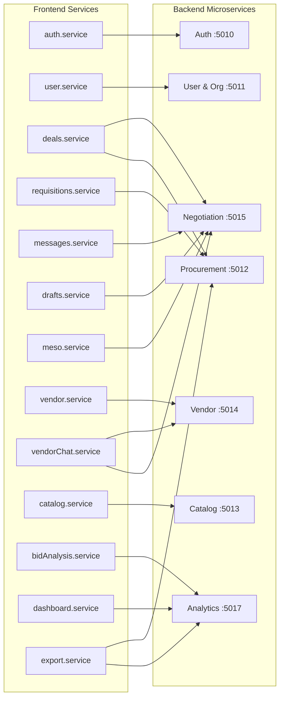

# Frontend Refactoring Plan

> **Status:** Approved — Execution pending backend microservice migration completion
> **Last Updated:** 2026-03-09
> **Scope:** `Accordo-ai-frontend/` (React 19 + Vite + TypeScript)
> **Prerequisite:** All 10 backend microservices extracted and stable

---

## Table of Contents

1. [Executive Summary](#1-executive-summary)
2. [Current State Analysis](#2-current-state-analysis)
3. [Architecture Decisions](#3-architecture-decisions)
4. [Backend Service to Frontend Module Mapping](#4-backend-service-to-frontend-module-mapping)
5. [New Shared Infrastructure](#5-new-shared-infrastructure)
6. [Service File Reorganization](#6-service-file-reorganization)
7. [Migration Plan](#7-migration-plan)
8. [Before/After Examples](#8-beforeafter-examples)
9. [Dependency Graph](#9-dependency-graph)
10. [Risk Assessment](#10-risk-assessment)
11. [Non-Breaking Guarantee](#11-non-breaking-guarantee)

---

## 1. Executive Summary

### Why This Refactoring

The Accordo-AI backend is being decomposed from a monolith into 10 microservices. The frontend was built against a single backend and carries accumulated technical debt: duplicated state patterns, a monolithic service file, no shared component library, and tight coupling to a single API base URL. Once the backend migration completes, the frontend must be refactored in a single coordinated pass to align with the new service topology.

### Goals

1. **Eliminate duplication** — Replace 59+ scattered `useState` calls with composable data-fetching primitives.
2. **Align with microservices** — Separate axios instances per backend service with independent base URLs.
3. **Create shared infrastructure** — Reusable hooks, components, and types that prevent future duplication.
4. **Unify multi-step forms** — One abstraction for the 3 existing wizard implementations.
5. **Standardize error handling** — Centralized error normalization, global interceptors, consistent toast notifications.
6. **Maintain zero downtime** — No existing functionality breaks during or after refactoring.

### Constraints

- React 19 + Vite + TypeScript stack is fixed (no framework migration).
- All imports use `.js` extensions (TypeScript ES Modules convention).
- The refactoring happens as a single pass after all 10 backend services are stable.
- During backend migration, only API base URL changes are permitted in the frontend.

---

## 2. Current State Analysis

### Problem Inventory

| # | Problem | Impact | Severity |
|---|---------|--------|----------|
| 1 | **59+ `useState` calls** scattered across hooks | Duplicated loading/error/data patterns in every hook | High |
| 2 | **Monolithic `chatbot.service.ts`** | 50+ methods, ~1500 lines, impossible to reason about | High |
| 3 | **3 independent multi-step form implementations** | Requisition, Vendor, Deal Wizard — no shared abstraction | Medium |
| 4 | **Duplicated API call wrappers** | Every hook repeats try/catch/loading/error boilerplate | High |
| 5 | **Inconsistent error handling** | `toast.error` in some places, `console.error` in others | Medium |
| 6 | **Duplicated filter/search state** | Each list page re-implements search, filter, pagination | Medium |
| 7 | **No shared component library** | Each page builds its own cards, tables, status badges | Medium |
| 8 | **Tight coupling to single backend** | `api/index.ts` has one base URL for everything | High |
| 9 | **Type duplication** | Similar interfaces defined in multiple files | Low |
| 10 | **No centralized state management** | Prop drilling and hook re-fetching | Medium |

### Current File Structure

```
src/
├── api/index.ts             # Single axios config (3 instances: api, authApi, authMultiFormApi)
├── services/
│   ├── chatbot.service.ts   # 50+ methods, ~1500 lines
│   ├── vendorChat.service.ts
│   ├── bidAnalysis.service.ts
│   ├── dashboard.service.ts
│   └── export.service.ts
├── hooks/
│   ├── chatbot/             # useDealActions.ts, useConversation.ts, useHistoryTracking.ts
│   ├── bidAnalysis/         # useBidActions.ts, useBidAnalysisDetail.ts, useBidAnalysisRequisitions.ts
│   └── dashboard/
├── types/
│   ├── chatbot.ts           # 900+ lines
│   ├── bidAnalysis.ts
│   └── management.types.ts
├── components/
│   ├── Requisition/         # Multi-step form #1
│   ├── VendorForm/          # Multi-step form #2
│   ├── chatbot/deal-wizard/ # Multi-step form #3
│   └── BidAnalysis/
├── pages/
└── utils/
```

---

## 3. Architecture Decisions

### Decision 1: API Layer Architecture

**Choice: Separate axios instances per backend service**

Each microservice gets its own axios instance with an independent base URL configured at runtime. A shared factory function ensures consistent interceptor setup across all instances.

**Rationale:** Allows gradual migration — as each backend service is extracted, only its corresponding axios instance needs a new base URL. Other services remain unchanged.

---

### Decision 2: Service File Organization

**Choice: Split `chatbot.service.ts` by feature domain**

| New File | Responsibility | Est. Size |
|----------|---------------|-----------|
| `deals.service.ts` | Deal CRUD, lifecycle, config, utility | ~200 lines |
| `requisitions.service.ts` | Requisition views, archive/unarchive | ~150 lines |
| `messages.service.ts` | Send/receive messages, suggested counters | ~200 lines |
| `drafts.service.ts` | Draft CRUD, auto-save | ~100 lines |
| `meso.service.ts` | MESO options, vendor chat MESO operations | ~150 lines |

**Rationale:** Each file is focused on a single domain, is small enough to reason about, and maps cleanly to backend microservice boundaries.

---

### Decision 3: Data Fetching Pattern

**Choice: `useFetch<T>()` + `useAction<T>()` custom hooks**

Two composable primitives that eliminate all duplicated loading/error/data state management. Existing hooks wrap these primitives rather than managing raw `useState` calls.

**Rationale:** Lightweight, no external dependency, composable. Eliminates 59+ duplicated patterns without adopting a heavy library like React Query.

---

### Decision 4: Shared UI Components

**Choice: Generic shared component library in `src/components/shared/`**

| Component | Purpose |
|-----------|---------|
| `DataCard` | Reusable card with header, stats, actions |
| `DataTable` | Sortable, filterable table with pagination |
| `FilterBar` | Search input + filter dropdowns + status chips |
| `ConfirmDialog` | Confirmation modal with customizable actions |
| `StatusBadge` | Color-coded status indicator (maps status to color) |

**Rationale:** Eliminates per-page reimplementation of common UI patterns. Components are generic enough to serve all feature areas.

---

### Decision 5: Multi-Step Form Architecture

**Choice: Both hook + component**

- `useMultiStepForm<T>()` hook — Step navigation, validation, dirty tracking, auto-save.
- `<WizardContainer>` component — Step indicators, nav buttons, progress bar.
- Individual step components remain separate for flexibility.

**Rationale:** The hook provides logic reuse; the component provides visual consistency. Together they replace 3 independent implementations.

---

### Decision 6: Type System

**Choice: Shared utility types in `src/types/common.ts`**

Defines generic types used across all features: `LoadingState<T>`, `PaginatedResult<T>`, `ApiResult<T>`, `FilterParams`.

**Rationale:** Eliminates type duplication, provides a single source of truth for cross-cutting data shapes.

---

### Decision 7: Filter/Search State

**Choice: `useFilterParams<T>()` hook with URL query param sync**

Reads filters from URL search params, updates URL on change, debounces search input, supports browser back/forward navigation.

**Rationale:** Replaces per-page filter state management. URL sync means filters survive page refresh and are shareable via URL.

---

### Decision 8: Error Handling

**Choice: Both centralized utility + axios interceptor**

- `handleApiError(error)` utility normalizes error responses and extracts messages.
- Axios response interceptor handles global 401/403/500 patterns.
- Toast notifications for user-facing errors; console logging for developer errors.

**Rationale:** Interceptors catch infrastructure-level errors globally; the utility function handles feature-level error display consistently.

---

### Decision 9: Migration Timing

**Choice: Single frontend refactor pass after all backend phases complete**

Wait for all 10 backend microservices to be extracted and stable, then execute one comprehensive frontend refactoring pass. During the backend migration, only update API base URLs as needed.

**Rationale:** Avoids refactoring the same frontend code multiple times. A single pass is more efficient and less error-prone than incremental changes.

---

### Decision 10: Documentation Depth

**Choice: Full doc with backend dependency mapping + sequence of changes**

This document includes: frontend-to-backend dependency mapping, ordered sequence of changes, before/after code examples, and a dependency graph.

**Rationale:** Developers need a complete working reference to execute the refactoring without ambiguity.

---

## 4. Backend Service to Frontend Module Mapping

### Service Dependency Matrix

| Backend Service (Port) | Frontend Services | Frontend Hooks | Frontend Pages/Components |
|------------------------|-------------------|----------------|--------------------------|
| **API Gateway (5002)** | All (routing layer) | — | — |
| **Auth (5010)** | `api/index.ts` (authApi) | Auth hooks | Login, Register |
| **User & Org (5011)** | `chatbot.service.ts` (user/company methods) | User management hooks | Profile, Admin, Company Settings |
| **Procurement (5012)** | `chatbot.service.ts` (requisitions, contracts, POs, deals) | `useDealActions`, `useBidAnalysisRequisitions` | Requisition/, Deal Wizard, Contracts |
| **Catalog (5013)** | `chatbot.service.ts` (product methods) | Product hooks | Product selection in forms |
| **Vendor (5014)** | `chatbot.service.ts` (vendor methods), `vendorChat.service.ts` | Vendor hooks | VendorForm/, Vendor list |
| **Negotiation (5015)** | `chatbot.service.ts` (chat, offers, MESO), `vendorChat.service.ts` | `useConversation`, `useDealActions` | Chatbot/, Deal detail |
| **LLM Gateway (5016)** | None (backend-only) | — | — |
| **Analytics (5017)** | `dashboard.service.ts`, `bidAnalysis.service.ts` | Dashboard hooks, `useBidAnalysisDetail` | Dashboard, BidAnalysis/ |
| **Notification (5018)** | None (backend-triggered) | — | — |

### Frontend Module to Service Mapping (Reverse)

```
src/services/
├── deals.service.ts         → Procurement (5012), Negotiation (5015)
├── requisitions.service.ts  → Procurement (5012)
├── messages.service.ts      → Negotiation (5015)
├── drafts.service.ts        → Negotiation (5015)
├── meso.service.ts          → Negotiation (5015)
├── vendorChat.service.ts    → Negotiation (5015), Vendor (5014)
├── bidAnalysis.service.ts   → Analytics (5017)
├── dashboard.service.ts     → Analytics (5017)
├── export.service.ts        → Analytics (5017), Procurement (5012)
├── auth.service.ts          → Auth (5010)
├── user.service.ts          → User & Org (5011)
├── vendor.service.ts        → Vendor (5014)
├── catalog.service.ts       → Catalog (5013)
└── notification.service.ts  → Notification (5018)
```

---

## 5. New Shared Infrastructure

### 5.1 API Layer Factory and Per-Service Instances

#### Factory Function

```typescript
// src/api/createServiceClient.ts
import axios, { AxiosInstance, AxiosRequestConfig, InternalAxiosRequestConfig, AxiosError } from 'axios';
import { handleApiError } from '../utils/handleApiError.js';

interface ServiceClientConfig {
  baseURL: string;
  /** Optional — override default timeout (10s) */
  timeout?: number;
  /** Optional — add custom headers to every request */
  defaultHeaders?: Record<string, string>;
}

export function createServiceClient(config: ServiceClientConfig): AxiosInstance {
  const instance = axios.create({
    baseURL: config.baseURL,
    timeout: config.timeout ?? 10_000,
    headers: {
      'Content-Type': 'application/json',
      ...config.defaultHeaders,
    },
  });

  // Request interceptor — attach JWT token
  instance.interceptors.request.use(
    (reqConfig: InternalAxiosRequestConfig) => {
      const token = localStorage.getItem('accessToken');
      if (token && reqConfig.headers) {
        reqConfig.headers.Authorization = token.startsWith('Bearer ')
          ? token
          : `Bearer ${token}`;
      }
      return reqConfig;
    },
    (error) => Promise.reject(error),
  );

  // Response interceptor — global error handling
  instance.interceptors.response.use(
    (response) => response,
    (error: AxiosError) => {
      if (error.response?.status === 401) {
        // Token expired — redirect to login
        localStorage.removeItem('accessToken');
        window.location.href = '/login';
        return Promise.reject(error);
      }
      if (error.response?.status === 403) {
        // Forbidden — user lacks permission
        console.error('[API] Forbidden:', error.config?.url);
      }
      if (error.response?.status && error.response.status >= 500) {
        console.error('[API] Server error:', error.config?.url, error.response.status);
      }
      return Promise.reject(error);
    },
  );

  return instance;
}
```

#### Per-Service Instances

```typescript
// src/api/services.ts
import { createServiceClient } from './createServiceClient.js';

// During monolith phase, all point to the same base URL.
// As microservices go live, update individual URLs.
const GATEWAY_URL = import.meta.env.VITE_API_GATEWAY_URL ?? 'http://localhost:5002';

export const authClient = createServiceClient({
  baseURL: import.meta.env.VITE_AUTH_SERVICE_URL ?? `${GATEWAY_URL}/api/auth`,
});

export const userClient = createServiceClient({
  baseURL: import.meta.env.VITE_USER_SERVICE_URL ?? `${GATEWAY_URL}/api/users`,
});

export const procurementClient = createServiceClient({
  baseURL: import.meta.env.VITE_PROCUREMENT_SERVICE_URL ?? `${GATEWAY_URL}/api`,
});

export const catalogClient = createServiceClient({
  baseURL: import.meta.env.VITE_CATALOG_SERVICE_URL ?? `${GATEWAY_URL}/api/products`,
});

export const vendorClient = createServiceClient({
  baseURL: import.meta.env.VITE_VENDOR_SERVICE_URL ?? `${GATEWAY_URL}/api/vendors`,
});

export const negotiationClient = createServiceClient({
  baseURL: import.meta.env.VITE_NEGOTIATION_SERVICE_URL ?? `${GATEWAY_URL}/api`,
  timeout: 30_000, // Negotiation can involve LLM calls — longer timeout
});

export const analyticsClient = createServiceClient({
  baseURL: import.meta.env.VITE_ANALYTICS_SERVICE_URL ?? `${GATEWAY_URL}/api`,
});

export const notificationClient = createServiceClient({
  baseURL: import.meta.env.VITE_NOTIFICATION_SERVICE_URL ?? `${GATEWAY_URL}/api/notifications`,
});

// Multipart form data client (for file uploads)
export const uploadClient = createServiceClient({
  baseURL: import.meta.env.VITE_API_GATEWAY_URL ?? `${GATEWAY_URL}/api`,
  defaultHeaders: { 'Content-Type': 'multipart/form-data' },
});
```

#### Environment Variables (`.env`)

```env
# During monolith phase — all route through the gateway
VITE_API_GATEWAY_URL=http://localhost:5002

# As microservices go live, uncomment and set individual URLs:
# VITE_AUTH_SERVICE_URL=http://localhost:5010/api/auth
# VITE_USER_SERVICE_URL=http://localhost:5011/api/users
# VITE_PROCUREMENT_SERVICE_URL=http://localhost:5012/api
# VITE_CATALOG_SERVICE_URL=http://localhost:5013/api/products
# VITE_VENDOR_SERVICE_URL=http://localhost:5014/api/vendors
# VITE_NEGOTIATION_SERVICE_URL=http://localhost:5015/api
# VITE_ANALYTICS_SERVICE_URL=http://localhost:5017/api
# VITE_NOTIFICATION_SERVICE_URL=http://localhost:5018/api/notifications
```

---

### 5.2 `useFetch<T>()` and `useAction<T>()` Hooks

#### `useFetch<T>()`

```typescript
// src/hooks/shared/useFetch.ts
import { useState, useEffect, useCallback, useRef } from 'react';
import { LoadingState } from '../../types/common.js';

interface UseFetchOptions {
  /** Skip the initial fetch (useful for conditional fetching) */
  skip?: boolean;
  /** Dependencies that trigger a refetch when changed */
  deps?: unknown[];
}

interface UseFetchReturn<T> extends LoadingState<T> {
  /** Manually trigger a refetch */
  refetch: () => Promise<void>;
  /** Reset state to initial values */
  reset: () => void;
}

export function useFetch<T>(
  fetcher: () => Promise<T>,
  options: UseFetchOptions = {},
): UseFetchReturn<T> {
  const { skip = false, deps = [] } = options;

  const [data, setData] = useState<T | null>(null);
  const [loading, setLoading] = useState(!skip);
  const [error, setError] = useState<string | null>(null);
  const isMounted = useRef(true);

  const fetchData = useCallback(async () => {
    setLoading(true);
    setError(null);
    try {
      const result = await fetcher();
      if (isMounted.current) {
        setData(result);
      }
    } catch (err) {
      if (isMounted.current) {
        setError(err instanceof Error ? err.message : 'An unexpected error occurred');
      }
    } finally {
      if (isMounted.current) {
        setLoading(false);
      }
    }
  }, [fetcher]);

  useEffect(() => {
    isMounted.current = true;
    if (!skip) {
      fetchData();
    }
    return () => {
      isMounted.current = false;
    };
    // eslint-disable-next-line react-hooks/exhaustive-deps
  }, [skip, ...deps]);

  const reset = useCallback(() => {
    setData(null);
    setLoading(false);
    setError(null);
  }, []);

  return { data, loading, error, refetch: fetchData, reset };
}
```

#### `useAction<T>()`

```typescript
// src/hooks/shared/useAction.ts
import { useState, useCallback, useRef } from 'react';
import { handleApiError } from '../../utils/handleApiError.js';
import { toast } from 'react-toastify';

interface UseActionOptions {
  /** Toast message on success */
  successMessage?: string;
  /** Show toast on error (default: true) */
  showErrorToast?: boolean;
  /** Callback after successful execution */
  onSuccess?: () => void;
}

interface UseActionReturn<TInput, TOutput> {
  /** Execute the action */
  execute: (input: TInput) => Promise<TOutput | null>;
  /** Whether the action is in progress */
  loading: boolean;
  /** Error message if the action failed */
  error: string | null;
  /** Reset error state */
  reset: () => void;
}

export function useAction<TInput = void, TOutput = void>(
  actionFn: (input: TInput) => Promise<TOutput>,
  options: UseActionOptions = {},
): UseActionReturn<TInput, TOutput> {
  const { successMessage, showErrorToast = true, onSuccess } = options;

  const [loading, setLoading] = useState(false);
  const [error, setError] = useState<string | null>(null);
  const isMounted = useRef(true);

  const execute = useCallback(
    async (input: TInput): Promise<TOutput | null> => {
      setLoading(true);
      setError(null);
      try {
        const result = await actionFn(input);
        if (isMounted.current) {
          if (successMessage) {
            toast.success(successMessage);
          }
          onSuccess?.();
        }
        return result;
      } catch (err) {
        const message = handleApiError(err);
        if (isMounted.current) {
          setError(message);
          if (showErrorToast) {
            toast.error(message);
          }
        }
        return null;
      } finally {
        if (isMounted.current) {
          setLoading(false);
        }
      }
    },
    [actionFn, successMessage, showErrorToast, onSuccess],
  );

  const reset = useCallback(() => setError(null), []);

  return { execute, loading, error, reset };
}
```

---

### 5.3 `useMultiStepForm<T>()` Hook and `<WizardContainer>`

#### `useMultiStepForm<T>()`

```typescript
// src/hooks/shared/useMultiStepForm.ts
import { useState, useCallback, useRef, useEffect } from 'react';

interface StepConfig {
  /** Unique step identifier */
  id: string;
  /** Display label for the step indicator */
  label: string;
  /** Validation function — return true if step data is valid */
  validate?: (data: unknown) => boolean | Promise<boolean>;
  /** Whether this step is optional */
  optional?: boolean;
}

interface UseMultiStepFormOptions<T> {
  steps: StepConfig[];
  initialData: T;
  /** Auto-save callback — called on step change if data is dirty */
  onAutoSave?: (data: T) => Promise<void>;
  /** Auto-save debounce interval in ms (default: 2000) */
  autoSaveInterval?: number;
}

interface UseMultiStepFormReturn<T> {
  /** Current step index (0-based) */
  currentStep: number;
  /** Current step config */
  currentStepConfig: StepConfig;
  /** All step configs */
  steps: StepConfig[];
  /** Form data */
  data: T;
  /** Whether current data differs from last saved state */
  isDirty: boolean;
  /** Whether we're on the last step */
  isLastStep: boolean;
  /** Whether we're on the first step */
  isFirstStep: boolean;
  /** Progress percentage (0-100) */
  progress: number;
  /** Update form data (partial merge) */
  updateData: (partial: Partial<T>) => void;
  /** Go to next step (validates current step first) */
  goNext: () => Promise<boolean>;
  /** Go to previous step */
  goBack: () => void;
  /** Jump to a specific step by index */
  goToStep: (index: number) => void;
  /** Reset form to initial state */
  reset: () => void;
  /** Validation errors for current step */
  validationError: string | null;
}

export function useMultiStepForm<T extends Record<string, unknown>>(
  options: UseMultiStepFormOptions<T>,
): UseMultiStepFormReturn<T> {
  const { steps, initialData, onAutoSave, autoSaveInterval = 2000 } = options;

  const [currentStep, setCurrentStep] = useState(0);
  const [data, setData] = useState<T>(initialData);
  const [isDirty, setIsDirty] = useState(false);
  const [validationError, setValidationError] = useState<string | null>(null);
  const savedData = useRef<T>(initialData);
  const autoSaveTimer = useRef<ReturnType<typeof setTimeout> | null>(null);

  const currentStepConfig = steps[currentStep];
  const isLastStep = currentStep === steps.length - 1;
  const isFirstStep = currentStep === 0;
  const progress = Math.round(((currentStep + 1) / steps.length) * 100);

  // Auto-save on dirty data
  useEffect(() => {
    if (isDirty && onAutoSave) {
      if (autoSaveTimer.current) clearTimeout(autoSaveTimer.current);
      autoSaveTimer.current = setTimeout(async () => {
        await onAutoSave(data);
        savedData.current = data;
        setIsDirty(false);
      }, autoSaveInterval);
    }
    return () => {
      if (autoSaveTimer.current) clearTimeout(autoSaveTimer.current);
    };
  }, [data, isDirty, onAutoSave, autoSaveInterval]);

  const updateData = useCallback((partial: Partial<T>) => {
    setData((prev) => ({ ...prev, ...partial }));
    setIsDirty(true);
    setValidationError(null);
  }, []);

  const goNext = useCallback(async (): Promise<boolean> => {
    const stepConfig = steps[currentStep];
    if (stepConfig.validate) {
      const isValid = await stepConfig.validate(data);
      if (!isValid) {
        setValidationError(`Please complete all required fields in "${stepConfig.label}"`);
        return false;
      }
    }
    setValidationError(null);
    if (currentStep < steps.length - 1) {
      setCurrentStep((prev) => prev + 1);
    }
    return true;
  }, [currentStep, data, steps]);

  const goBack = useCallback(() => {
    setValidationError(null);
    if (currentStep > 0) {
      setCurrentStep((prev) => prev - 1);
    }
  }, [currentStep]);

  const goToStep = useCallback(
    (index: number) => {
      if (index >= 0 && index < steps.length) {
        setValidationError(null);
        setCurrentStep(index);
      }
    },
    [steps.length],
  );

  const reset = useCallback(() => {
    setCurrentStep(0);
    setData(initialData);
    setIsDirty(false);
    setValidationError(null);
    savedData.current = initialData;
  }, [initialData]);

  return {
    currentStep,
    currentStepConfig,
    steps,
    data,
    isDirty,
    isLastStep,
    isFirstStep,
    progress,
    updateData,
    goNext,
    goBack,
    goToStep,
    reset,
    validationError,
  };
}
```

#### `<WizardContainer>`

```typescript
// src/components/shared/WizardContainer.tsx
import React from 'react';

interface WizardContainerProps {
  /** Step labels */
  steps: { id: string; label: string; optional?: boolean }[];
  /** Current step index (0-based) */
  currentStep: number;
  /** Progress percentage (0-100) */
  progress: number;
  /** Whether the form is on the first step */
  isFirstStep: boolean;
  /** Whether the form is on the last step */
  isLastStep: boolean;
  /** Validation error message */
  validationError: string | null;
  /** Called when user clicks Next */
  onNext: () => void;
  /** Called when user clicks Back */
  onBack: () => void;
  /** Called when user clicks a step indicator */
  onStepClick: (index: number) => void;
  /** Called when user clicks Submit on the last step */
  onSubmit: () => void;
  /** Whether submission is in progress */
  submitting?: boolean;
  /** Label for the submit button (default: "Submit") */
  submitLabel?: string;
  /** The active step content */
  children: React.ReactNode;
}

export function WizardContainer({
  steps,
  currentStep,
  progress,
  isFirstStep,
  isLastStep,
  validationError,
  onNext,
  onBack,
  onStepClick,
  onSubmit,
  submitting = false,
  submitLabel = 'Submit',
  children,
}: WizardContainerProps) {
  return (
    <div className="wizard-container">
      {/* Progress bar */}
      <div className="wizard-progress">
        <div className="wizard-progress-bar" style={{ width: `${progress}%` }} />
      </div>

      {/* Step indicators */}
      <nav className="wizard-steps">
        {steps.map((step, index) => (
          <button
            key={step.id}
            className={`wizard-step ${index === currentStep ? 'active' : ''} ${index < currentStep ? 'completed' : ''}`}
            onClick={() => onStepClick(index)}
            disabled={index > currentStep}
            type="button"
          >
            <span className="wizard-step-number">{index + 1}</span>
            <span className="wizard-step-label">
              {step.label}
              {step.optional && <span className="wizard-step-optional">(optional)</span>}
            </span>
          </button>
        ))}
      </nav>

      {/* Step content */}
      <div className="wizard-content">{children}</div>

      {/* Validation error */}
      {validationError && <div className="wizard-error">{validationError}</div>}

      {/* Navigation buttons */}
      <div className="wizard-nav">
        <button
          type="button"
          className="wizard-nav-back"
          onClick={onBack}
          disabled={isFirstStep}
        >
          Back
        </button>
        {isLastStep ? (
          <button
            type="button"
            className="wizard-nav-submit"
            onClick={onSubmit}
            disabled={submitting}
          >
            {submitting ? 'Submitting...' : submitLabel}
          </button>
        ) : (
          <button type="button" className="wizard-nav-next" onClick={onNext}>
            Next
          </button>
        )}
      </div>
    </div>
  );
}
```

---

### 5.4 `useFilterParams<T>()` Hook

```typescript
// src/hooks/shared/useFilterParams.ts
import { useCallback, useMemo, useRef, useEffect, useState } from 'react';
import { useSearchParams } from 'react-router-dom';
import { FilterParams } from '../../types/common.js';

interface UseFilterParamsOptions {
  /** Default values for filters */
  defaults?: Partial<FilterParams>;
  /** Debounce delay for search input in ms (default: 300) */
  debounceMs?: number;
}

interface UseFilterParamsReturn extends FilterParams {
  /** Update a single filter value */
  setFilter: (key: keyof FilterParams, value: string | number | undefined) => void;
  /** Update the search term (debounced) */
  setSearch: (term: string) => void;
  /** Reset all filters to defaults */
  resetFilters: () => void;
  /** Raw search input value (before debounce) */
  searchInput: string;
}

export function useFilterParams(options: UseFilterParamsOptions = {}): UseFilterParamsReturn {
  const { defaults = {}, debounceMs = 300 } = options;
  const [searchParams, setSearchParams] = useSearchParams();
  const [searchInput, setSearchInputState] = useState(
    searchParams.get('search') ?? defaults.search ?? '',
  );
  const debounceTimer = useRef<ReturnType<typeof setTimeout> | null>(null);

  // Parse current params from URL
  const params: FilterParams = useMemo(
    () => ({
      search: searchParams.get('search') ?? defaults.search,
      status: searchParams.get('status') ?? defaults.status,
      page: Number(searchParams.get('page')) || defaults.page || 1,
      pageSize: Number(searchParams.get('pageSize')) || defaults.pageSize || 20,
    }),
    [searchParams, defaults],
  );

  const setFilter = useCallback(
    (key: keyof FilterParams, value: string | number | undefined) => {
      setSearchParams((prev) => {
        const next = new URLSearchParams(prev);
        if (value === undefined || value === '') {
          next.delete(key);
        } else {
          next.set(key, String(value));
        }
        // Reset to page 1 when filters change (unless changing page itself)
        if (key !== 'page') {
          next.set('page', '1');
        }
        return next;
      });
    },
    [setSearchParams],
  );

  const setSearch = useCallback(
    (term: string) => {
      setSearchInputState(term);
      if (debounceTimer.current) clearTimeout(debounceTimer.current);
      debounceTimer.current = setTimeout(() => {
        setFilter('search', term || undefined);
      }, debounceMs);
    },
    [setFilter, debounceMs],
  );

  const resetFilters = useCallback(() => {
    setSearchParams(new URLSearchParams());
    setSearchInputState('');
  }, [setSearchParams]);

  // Cleanup debounce timer on unmount
  useEffect(() => {
    return () => {
      if (debounceTimer.current) clearTimeout(debounceTimer.current);
    };
  }, []);

  return {
    ...params,
    setFilter,
    setSearch,
    resetFilters,
    searchInput,
  };
}
```

---

### 5.5 Shared Component Library Specs

All components located in `src/components/shared/`.

#### `StatusBadge`

```typescript
// src/components/shared/StatusBadge.tsx
import React from 'react';

type BadgeVariant = 'success' | 'warning' | 'danger' | 'info' | 'neutral';

const STATUS_MAP: Record<string, BadgeVariant> = {
  active: 'success',
  approved: 'success',
  completed: 'success',
  accepted: 'success',
  pending: 'warning',
  in_progress: 'warning',
  negotiating: 'warning',
  draft: 'neutral',
  archived: 'neutral',
  rejected: 'danger',
  expired: 'danger',
  cancelled: 'danger',
};

interface StatusBadgeProps {
  status: string;
  /** Override automatic variant mapping */
  variant?: BadgeVariant;
  /** Display label (defaults to formatted status string) */
  label?: string;
}

export function StatusBadge({ status, variant, label }: StatusBadgeProps) {
  const resolvedVariant = variant ?? STATUS_MAP[status.toLowerCase()] ?? 'neutral';
  const displayLabel = label ?? status.replace(/_/g, ' ').replace(/\b\w/g, (c) => c.toUpperCase());

  return <span className={`status-badge status-badge--${resolvedVariant}`}>{displayLabel}</span>;
}
```

#### `ConfirmDialog`

```typescript
// src/components/shared/ConfirmDialog.tsx
import React from 'react';

interface ConfirmDialogProps {
  open: boolean;
  title: string;
  message: string;
  confirmLabel?: string;
  cancelLabel?: string;
  variant?: 'danger' | 'warning' | 'info';
  loading?: boolean;
  onConfirm: () => void;
  onCancel: () => void;
}

export function ConfirmDialog({
  open,
  title,
  message,
  confirmLabel = 'Confirm',
  cancelLabel = 'Cancel',
  variant = 'info',
  loading = false,
  onConfirm,
  onCancel,
}: ConfirmDialogProps) {
  if (!open) return null;

  return (
    <div className="confirm-dialog-overlay" onClick={onCancel}>
      <div className="confirm-dialog" onClick={(e) => e.stopPropagation()}>
        <h3 className="confirm-dialog-title">{title}</h3>
        <p className="confirm-dialog-message">{message}</p>
        <div className="confirm-dialog-actions">
          <button type="button" className="confirm-dialog-cancel" onClick={onCancel}>
            {cancelLabel}
          </button>
          <button
            type="button"
            className={`confirm-dialog-confirm confirm-dialog-confirm--${variant}`}
            onClick={onConfirm}
            disabled={loading}
          >
            {loading ? 'Processing...' : confirmLabel}
          </button>
        </div>
      </div>
    </div>
  );
}
```

#### `DataTable` (Interface)

```typescript
// src/components/shared/DataTable.tsx
import React from 'react';

interface Column<T> {
  /** Unique column key */
  key: string;
  /** Column header label */
  header: string;
  /** Render cell content */
  render: (row: T) => React.ReactNode;
  /** Whether column is sortable */
  sortable?: boolean;
  /** Column width (CSS value) */
  width?: string;
}

interface DataTableProps<T> {
  columns: Column<T>[];
  data: T[];
  /** Unique key extractor for each row */
  rowKey: (row: T) => string;
  /** Current sort column */
  sortBy?: string;
  /** Sort direction */
  sortOrder?: 'asc' | 'desc';
  /** Called when a sortable column header is clicked */
  onSort?: (columnKey: string) => void;
  /** Loading state */
  loading?: boolean;
  /** Message when data is empty */
  emptyMessage?: string;
  /** Pagination */
  pagination?: {
    page: number;
    pageSize: number;
    total: number;
    onPageChange: (page: number) => void;
  };
  /** Row click handler */
  onRowClick?: (row: T) => void;
}

export function DataTable<T>({ columns, data, rowKey, loading, emptyMessage, pagination, sortBy, sortOrder, onSort, onRowClick }: DataTableProps<T>) {
  // Implementation: render <table> with headers, sortable columns, rows, pagination controls.
  // Skeleton rows shown during loading state.
  // Empty state message when data.length === 0 and not loading.
  // Full implementation deferred to execution phase.
  return <>{/* ... */}</>;
}
```

#### `FilterBar` (Interface)

```typescript
// src/components/shared/FilterBar.tsx
import React from 'react';

interface FilterOption {
  label: string;
  value: string;
}

interface FilterDropdown {
  key: string;
  label: string;
  options: FilterOption[];
  value?: string;
}

interface FilterBarProps {
  /** Search input value */
  searchValue: string;
  /** Search input change handler */
  onSearchChange: (value: string) => void;
  /** Search input placeholder */
  searchPlaceholder?: string;
  /** Filter dropdowns */
  filters?: FilterDropdown[];
  /** Called when a filter dropdown value changes */
  onFilterChange?: (key: string, value: string) => void;
  /** Active filter chips (for visual display of applied filters) */
  activeFilters?: { key: string; label: string }[];
  /** Called when an active filter chip is removed */
  onRemoveFilter?: (key: string) => void;
  /** Called when "Clear all" is clicked */
  onClearAll?: () => void;
}

export function FilterBar(props: FilterBarProps) {
  // Implementation: Search input + dropdown selects + active filter chips + clear all button.
  // Full implementation deferred to execution phase.
  return <>{/* ... */}</>;
}
```

#### `DataCard` (Interface)

```typescript
// src/components/shared/DataCard.tsx
import React from 'react';

interface DataCardProps {
  /** Card title */
  title: string;
  /** Optional subtitle */
  subtitle?: string;
  /** Status badge (rendered in top-right) */
  status?: React.ReactNode;
  /** Key-value stats displayed in the card body */
  stats?: { label: string; value: React.ReactNode }[];
  /** Action buttons in the card footer */
  actions?: { label: string; onClick: () => void; variant?: 'primary' | 'secondary' | 'danger' }[];
  /** Card click handler */
  onClick?: () => void;
  /** Additional CSS class */
  className?: string;
  children?: React.ReactNode;
}

export function DataCard({ title, subtitle, status, stats, actions, onClick, className, children }: DataCardProps) {
  // Implementation: Card with header (title + status), body (stats grid or children), footer (action buttons).
  // Full implementation deferred to execution phase.
  return <>{/* ... */}</>;
}
```

---

### 5.6 Shared Utility Types

```typescript
// src/types/common.ts

/** Standard loading state for data fetching */
export interface LoadingState<T> {
  data: T | null;
  loading: boolean;
  error: string | null;
}

/** Paginated API response wrapper */
export interface PaginatedResult<T> {
  items: T[];
  total: number;
  page: number;
  pageSize: number;
}

/** Standard API response envelope */
export interface ApiResult<T> {
  success: boolean;
  data: T;
  message?: string;
}

/** Common filter/search parameters */
export interface FilterParams {
  search?: string;
  status?: string;
  page?: number;
  pageSize?: number;
}

/** Sort configuration */
export interface SortConfig {
  field: string;
  order: 'asc' | 'desc';
}

/** Generic key-value record for form data */
export type FormData<T> = {
  [K in keyof T]: T[K];
};
```

---

### 5.7 Error Handling Architecture

#### Error Normalization Utility

```typescript
// src/utils/handleApiError.ts
import { AxiosError } from 'axios';

interface ApiErrorResponse {
  message?: string;
  error?: string;
  errors?: string[];
}

/**
 * Normalizes any error into a user-friendly message string.
 * Used by useAction and can be called directly in service methods.
 */
export function handleApiError(error: unknown): string {
  // Axios error with response
  if (error instanceof AxiosError && error.response) {
    const data = error.response.data as ApiErrorResponse | undefined;

    // Server returned structured error
    if (data?.message) return data.message;
    if (data?.error) return data.error;
    if (data?.errors?.length) return data.errors.join('; ');

    // HTTP status-based fallbacks
    switch (error.response.status) {
      case 400: return 'Invalid request. Please check your input.';
      case 401: return 'Session expired. Please log in again.';
      case 403: return 'You do not have permission to perform this action.';
      case 404: return 'The requested resource was not found.';
      case 409: return 'A conflict occurred. Please refresh and try again.';
      case 422: return 'Validation failed. Please check your input.';
      case 429: return 'Too many requests. Please wait a moment.';
      default:  return 'An unexpected server error occurred. Please try again.';
    }
  }

  // Axios error without response (network error)
  if (error instanceof AxiosError && !error.response) {
    return 'Unable to reach the server. Please check your connection.';
  }

  // Standard JS error
  if (error instanceof Error) {
    return error.message;
  }

  return 'An unexpected error occurred.';
}
```

#### Error Handling Flow

```
API Call fails
    │
    ├── Axios Response Interceptor (global)
    │   ├── 401 → Clear token, redirect to /login
    │   ├── 403 → Console error (logged)
    │   └── 5xx → Console error (logged)
    │   └── Re-throw error to caller
    │
    ├── useAction() catch block
    │   ├── handleApiError(err) → normalized message
    │   ├── Set error state
    │   └── toast.error(message) (if showErrorToast=true)
    │
    └── useFetch() catch block
        ├── handleApiError(err) → normalized message
        └── Set error state (component renders error UI)
```

---

## 6. Service File Reorganization

### Current Structure (Before)

```
src/services/
├── chatbot.service.ts        # ~1500 lines, 50+ methods
├── vendorChat.service.ts
├── bidAnalysis.service.ts
├── dashboard.service.ts
└── export.service.ts
```

### New Structure (After)

```
src/services/
├── auth.service.ts           # Login, logout, token refresh
├── user.service.ts           # User CRUD, profile, roles
├── deals.service.ts          # Deal CRUD, lifecycle, config, utility
├── requisitions.service.ts   # Requisition views, archive/unarchive
├── messages.service.ts       # Send/receive messages, suggested counters
├── drafts.service.ts         # Draft CRUD, auto-save
├── meso.service.ts           # MESO options, vendor chat MESO ops
├── vendor.service.ts         # Vendor management, invite, portal
├── vendorChat.service.ts     # Vendor-side chat operations (retained)
├── catalog.service.ts        # Product CRUD, categories
├── bidAnalysis.service.ts    # Bid analysis operations (retained)
├── dashboard.service.ts      # Dashboard stats, reports (retained)
├── export.service.ts         # CSV/PDF exports (retained)
└── notification.service.ts   # Notification preferences, history
```

### Migration Mapping from `chatbot.service.ts`

| Method Group | Current Location | New File | Backend Service |
|-------------|-----------------|----------|-----------------|
| `getDeals`, `getDeal`, `createDeal`, `updateDeal`, `deleteDeal`, `getDealConfig` | `chatbot.service.ts` | `deals.service.ts` | Procurement (5012) |
| `getRequisitions`, `archiveRequisition`, `unarchiveRequisition`, `getRequisitionDetails` | `chatbot.service.ts` | `requisitions.service.ts` | Procurement (5012) |
| `sendMessage`, `getMessages`, `getSuggestedCounters`, `getConversationHistory` | `chatbot.service.ts` | `messages.service.ts` | Negotiation (5015) |
| `getDrafts`, `saveDraft`, `deleteDraft`, `autoSaveDraft` | `chatbot.service.ts` | `drafts.service.ts` | Negotiation (5015) |
| `getMesoOptions`, `submitMeso`, `getMesoHistory` | `chatbot.service.ts` | `meso.service.ts` | Negotiation (5015) |
| `getVendors`, `inviteVendor`, `getVendorDetails` | `chatbot.service.ts` | `vendor.service.ts` | Vendor (5014) |
| `getProducts`, `searchProducts` | `chatbot.service.ts` | `catalog.service.ts` | Catalog (5013) |
| `getUserProfile`, `updateProfile`, `getCompanyUsers` | `chatbot.service.ts` | `user.service.ts` | User & Org (5011) |

---

## 7. Migration Plan

### Prerequisites

- All 10 backend microservices extracted and stable.
- API Gateway routing verified for all services.
- Backend API contracts documented (request/response schemas).

### Execution Sequence

The sequence is ordered to build foundational layers first, then progressively refactor feature modules.

#### Phase 1: Foundation (Est. 3-4 days)

| Step | Task | Files Created/Modified |
|------|------|----------------------|
| 1.1 | Create `src/types/common.ts` with shared utility types | `types/common.ts` |
| 1.2 | Create `src/utils/handleApiError.ts` | `utils/handleApiError.ts` |
| 1.3 | Create `src/api/createServiceClient.ts` factory | `api/createServiceClient.ts` |
| 1.4 | Create `src/api/services.ts` with per-service instances | `api/services.ts` |
| 1.5 | Add environment variables to `.env` and `.env.example` | `.env`, `.env.example` |
| 1.6 | Create `src/hooks/shared/useFetch.ts` | `hooks/shared/useFetch.ts` |
| 1.7 | Create `src/hooks/shared/useAction.ts` | `hooks/shared/useAction.ts` |
| 1.8 | Create `src/hooks/shared/useFilterParams.ts` | `hooks/shared/useFilterParams.ts` |
| 1.9 | Create `src/hooks/shared/useMultiStepForm.ts` | `hooks/shared/useMultiStepForm.ts` |

**Checkpoint:** All shared primitives exist and have unit tests. No existing code is modified yet.

#### Phase 2: Shared Components (Est. 2-3 days)

| Step | Task | Files Created |
|------|------|--------------|
| 2.1 | Create `StatusBadge` component | `components/shared/StatusBadge.tsx` |
| 2.2 | Create `ConfirmDialog` component | `components/shared/ConfirmDialog.tsx` |
| 2.3 | Create `DataCard` component | `components/shared/DataCard.tsx` |
| 2.4 | Create `DataTable` component | `components/shared/DataTable.tsx` |
| 2.5 | Create `FilterBar` component | `components/shared/FilterBar.tsx` |
| 2.6 | Create `WizardContainer` component | `components/shared/WizardContainer.tsx` |
| 2.7 | Create `components/shared/index.ts` barrel export | `components/shared/index.ts` |

**Checkpoint:** All shared components render correctly in isolation. No existing code is modified yet.

#### Phase 3: Service Layer Split (Est. 3-4 days)

| Step | Task | Files Created/Modified |
|------|------|----------------------|
| 3.1 | Create `deals.service.ts` — extract deal methods from `chatbot.service.ts` | `services/deals.service.ts` |
| 3.2 | Create `requisitions.service.ts` — extract requisition methods | `services/requisitions.service.ts` |
| 3.3 | Create `messages.service.ts` — extract message methods | `services/messages.service.ts` |
| 3.4 | Create `drafts.service.ts` — extract draft methods | `services/drafts.service.ts` |
| 3.5 | Create `meso.service.ts` — extract MESO methods | `services/meso.service.ts` |
| 3.6 | Create `vendor.service.ts` — extract vendor methods | `services/vendor.service.ts` |
| 3.7 | Create `catalog.service.ts` — extract product methods | `services/catalog.service.ts` |
| 3.8 | Create `user.service.ts` — extract user/profile methods | `services/user.service.ts` |
| 3.9 | Create `auth.service.ts` — extract auth methods | `services/auth.service.ts` |
| 3.10 | Update all new services to use per-service axios instances from `api/services.ts` | All new service files |
| 3.11 | Keep `chatbot.service.ts` as a re-export facade (temporary) | `services/chatbot.service.ts` |

**Checkpoint:** New service files work. `chatbot.service.ts` re-exports everything so existing hooks still work. Zero functional changes.

#### Phase 4: Hook Migration (Est. 4-5 days)

| Step | Task | Files Modified |
|------|------|---------------|
| 4.1 | Refactor `useDealActions.ts` to use `useFetch`/`useAction` + new services | `hooks/chatbot/useDealActions.ts` |
| 4.2 | Refactor `useConversation.ts` to use `useFetch`/`useAction` + `messages.service.ts` | `hooks/chatbot/useConversation.ts` |
| 4.3 | Refactor `useHistoryTracking.ts` | `hooks/chatbot/useHistoryTracking.ts` |
| 4.4 | Refactor `useBidActions.ts` to use `useFetch`/`useAction` | `hooks/bidAnalysis/useBidActions.ts` |
| 4.5 | Refactor `useBidAnalysisDetail.ts` | `hooks/bidAnalysis/useBidAnalysisDetail.ts` |
| 4.6 | Refactor `useBidAnalysisRequisitions.ts` | `hooks/bidAnalysis/useBidAnalysisRequisitions.ts` |
| 4.7 | Refactor dashboard hooks | `hooks/dashboard/` |
| 4.8 | Migrate list pages to use `useFilterParams` | Various page components |
| 4.9 | Remove `chatbot.service.ts` facade once all imports are updated | Delete `services/chatbot.service.ts` |

**Checkpoint:** All hooks use the new primitives. 59+ `useState` patterns eliminated.

#### Phase 5: Component Migration (Est. 4-5 days)

| Step | Task | Files Modified |
|------|------|---------------|
| 5.1 | Refactor Requisition form to use `useMultiStepForm` + `WizardContainer` | `components/Requisition/` |
| 5.2 | Refactor VendorForm to use `useMultiStepForm` + `WizardContainer` | `components/VendorForm/` |
| 5.3 | Refactor Deal Wizard to use `useMultiStepForm` + `WizardContainer` | `components/chatbot/deal-wizard/` |
| 5.4 | Replace inline status badges with `StatusBadge` across all pages | Various components |
| 5.5 | Replace inline confirmation modals with `ConfirmDialog` | Various components |
| 5.6 | Replace inline cards with `DataCard` where applicable | Various components |
| 5.7 | Replace inline tables with `DataTable` where applicable | Various page components |
| 5.8 | Replace inline filter/search bars with `FilterBar` | Various page components |

**Checkpoint:** All three multi-step forms use the shared abstraction. Shared components used across all pages.

#### Phase 6: Cleanup and Verification (Est. 2-3 days)

| Step | Task |
|------|------|
| 6.1 | Remove dead code — unused imports, orphaned components, old patterns |
| 6.2 | Consolidate type definitions — move duplicates into `types/common.ts` or domain files |
| 6.3 | Run full test suite — unit tests, integration tests |
| 6.4 | Manual QA — test every feature flow end-to-end |
| 6.5 | Performance audit — verify no regression in bundle size or render performance |
| 6.6 | Update API base URLs to point to individual microservices (if not already done) |

**Total estimated effort: 18-24 days**

---

## 8. Before/After Examples

### Example 1: Data Fetching in a Hook

**Before** (`useDealActions.ts` — current pattern):

```typescript
// Current: Manual useState for every piece of state
export function useDealActions(dealId: string) {
  const [deal, setDeal] = useState<Deal | null>(null);
  const [loading, setLoading] = useState(true);
  const [error, setError] = useState<string | null>(null);
  const [updating, setUpdating] = useState(false);
  const [updateError, setUpdateError] = useState<string | null>(null);

  useEffect(() => {
    const fetchDeal = async () => {
      setLoading(true);
      setError(null);
      try {
        const result = await chatbotService.getDeal(dealId);
        setDeal(result);
      } catch (err) {
        console.error('Failed to fetch deal:', err);
        setError('Failed to load deal');
      } finally {
        setLoading(false);
      }
    };
    fetchDeal();
  }, [dealId]);

  const updateDeal = async (data: Partial<Deal>) => {
    setUpdating(true);
    setUpdateError(null);
    try {
      const result = await chatbotService.updateDeal(dealId, data);
      setDeal(result);
      toast.success('Deal updated');
    } catch (err) {
      console.error('Failed to update deal:', err);
      toast.error('Failed to update deal');
      setUpdateError('Failed to update deal');
    } finally {
      setUpdating(false);
    }
  };

  return { deal, loading, error, updateDeal, updating, updateError };
}
```

**After** (refactored):

```typescript
// Refactored: useFetch + useAction eliminate all boilerplate
import { useFetch } from '../shared/useFetch.js';
import { useAction } from '../shared/useAction.js';
import { dealsService } from '../../services/deals.service.js';

export function useDealActions(dealId: string) {
  const {
    data: deal,
    loading,
    error,
    refetch,
  } = useFetch(() => dealsService.getDeal(dealId), { deps: [dealId] });

  const { execute: updateDeal, loading: updating, error: updateError } = useAction(
    (data: Partial<Deal>) => dealsService.updateDeal(dealId, data),
    { successMessage: 'Deal updated', onSuccess: refetch },
  );

  return { deal, loading, error, updateDeal, updating, updateError };
}
```

**Impact:** 30 lines reduced to 15. Loading/error/toast handling is automatic.

---

### Example 2: API Service Call

**Before** (`chatbot.service.ts` — using shared api instance):

```typescript
// Current: All methods use the same `api` instance from api/index.ts
import api from '../api/index.js';

export const getDeals = async (): Promise<Deal[]> => {
  const response = await api.get('/deals');
  return response.data.data;
};

export const getRequisitions = async (): Promise<Requisition[]> => {
  const response = await api.get('/requisitions');
  return response.data.data;
};

export const sendMessage = async (dealId: string, message: string): Promise<Message> => {
  const response = await api.post(`/deals/${dealId}/messages`, { message });
  return response.data.data;
};
// ... 47 more methods in the same file
```

**After** (split into focused files with per-service clients):

```typescript
// deals.service.ts — uses procurementClient
import { procurementClient } from '../api/services.js';

export const dealsService = {
  getDeals: async (): Promise<Deal[]> => {
    const response = await procurementClient.get('/deals');
    return response.data.data;
  },
  // ... only deal-related methods
};

// requisitions.service.ts — uses procurementClient
import { procurementClient } from '../api/services.js';

export const requisitionsService = {
  getRequisitions: async (): Promise<Requisition[]> => {
    const response = await procurementClient.get('/requisitions');
    return response.data.data;
  },
  // ... only requisition-related methods
};

// messages.service.ts — uses negotiationClient
import { negotiationClient } from '../api/services.js';

export const messagesService = {
  sendMessage: async (dealId: string, message: string): Promise<Message> => {
    const response = await negotiationClient.post(`/deals/${dealId}/messages`, { message });
    return response.data.data;
  },
  // ... only message-related methods
};
```

---

### Example 3: Multi-Step Form

**Before** (Deal Wizard — custom step management):

```typescript
// Current: Each wizard manages its own step state, validation, navigation
function DealWizard() {
  const [step, setStep] = useState(0);
  const [formData, setFormData] = useState<DealFormData>({});
  const [errors, setErrors] = useState<Record<string, string>>({});

  const steps = ['Basic Info', 'Products', 'Negotiation Config', 'Review'];

  const handleNext = () => {
    if (validateStep(step, formData)) {
      setStep((s) => Math.min(s + 1, steps.length - 1));
    }
  };

  const handleBack = () => setStep((s) => Math.max(s - 1, 0));

  return (
    <div>
      {/* Custom step indicators */}
      <div className="steps">
        {steps.map((label, i) => (
          <div key={label} className={i === step ? 'active' : ''}>{label}</div>
        ))}
      </div>
      {/* Step content */}
      {step === 0 && <BasicInfoStep data={formData} onChange={setFormData} />}
      {step === 1 && <ProductsStep data={formData} onChange={setFormData} />}
      {step === 2 && <NegotiationConfigStep data={formData} onChange={setFormData} />}
      {step === 3 && <ReviewStep data={formData} />}
      {/* Custom navigation */}
      <button onClick={handleBack} disabled={step === 0}>Back</button>
      <button onClick={step === 3 ? handleSubmit : handleNext}>
        {step === 3 ? 'Create Deal' : 'Next'}
      </button>
    </div>
  );
}
```

**After** (using shared `useMultiStepForm` + `WizardContainer`):

```typescript
// Refactored: Shared hook + component
import { useMultiStepForm } from '../../hooks/shared/useMultiStepForm.js';
import { WizardContainer } from '../../components/shared/WizardContainer.js';

const DEAL_STEPS = [
  { id: 'basic', label: 'Basic Info', validate: validateBasicInfo },
  { id: 'products', label: 'Products', validate: validateProducts },
  { id: 'config', label: 'Negotiation Config', validate: validateConfig },
  { id: 'review', label: 'Review' },
];

function DealWizard() {
  const form = useMultiStepForm<DealFormData>({
    steps: DEAL_STEPS,
    initialData: {},
    onAutoSave: (data) => draftsService.autoSaveDraft('deal', data),
  });

  const { execute: createDeal, loading: submitting } = useAction(
    () => dealsService.createDeal(form.data),
    { successMessage: 'Deal created successfully' },
  );

  const stepComponents: Record<string, React.ReactNode> = {
    basic: <BasicInfoStep data={form.data} onChange={form.updateData} />,
    products: <ProductsStep data={form.data} onChange={form.updateData} />,
    config: <NegotiationConfigStep data={form.data} onChange={form.updateData} />,
    review: <ReviewStep data={form.data} />,
  };

  return (
    <WizardContainer
      steps={form.steps}
      currentStep={form.currentStep}
      progress={form.progress}
      isFirstStep={form.isFirstStep}
      isLastStep={form.isLastStep}
      validationError={form.validationError}
      onNext={form.goNext}
      onBack={form.goBack}
      onStepClick={form.goToStep}
      onSubmit={createDeal}
      submitting={submitting}
      submitLabel="Create Deal"
    >
      {stepComponents[form.currentStepConfig.id]}
    </WizardContainer>
  );
}
```

---

### Example 4: List Page with Filters

**Before** (manual filter state):

```typescript
function RequisitionsPage() {
  const [search, setSearch] = useState('');
  const [status, setStatus] = useState('');
  const [page, setPage] = useState(1);
  const [requisitions, setRequisitions] = useState<Requisition[]>([]);
  const [loading, setLoading] = useState(true);
  const [total, setTotal] = useState(0);

  useEffect(() => {
    setLoading(true);
    chatbotService.getRequisitions({ search, status, page })
      .then((res) => { setRequisitions(res.items); setTotal(res.total); })
      .catch(() => toast.error('Failed to load'))
      .finally(() => setLoading(false));
  }, [search, status, page]);

  return (
    <div>
      <input value={search} onChange={(e) => { setSearch(e.target.value); setPage(1); }} />
      <select value={status} onChange={(e) => { setStatus(e.target.value); setPage(1); }}>...</select>
      {/* table rendering... */}
    </div>
  );
}
```

**After** (using `useFilterParams` + `useFetch` + `DataTable` + `FilterBar`):

```typescript
import { useFilterParams } from '../../hooks/shared/useFilterParams.js';
import { useFetch } from '../../hooks/shared/useFetch.js';
import { DataTable, FilterBar } from '../../components/shared/index.js';
import { requisitionsService } from '../../services/requisitions.service.js';

function RequisitionsPage() {
  const filters = useFilterParams({ defaults: { pageSize: 20 } });

  const { data, loading } = useFetch(
    () => requisitionsService.getRequisitions(filters),
    { deps: [filters.search, filters.status, filters.page] },
  );

  return (
    <div>
      <FilterBar
        searchValue={filters.searchInput}
        onSearchChange={filters.setSearch}
        searchPlaceholder="Search requisitions..."
        filters={[
          { key: 'status', label: 'Status', options: STATUS_OPTIONS, value: filters.status },
        ]}
        onFilterChange={(key, value) => filters.setFilter(key as keyof FilterParams, value)}
        onClearAll={filters.resetFilters}
      />
      <DataTable
        columns={REQUISITION_COLUMNS}
        data={data?.items ?? []}
        rowKey={(r) => r.id}
        loading={loading}
        pagination={{
          page: filters.page ?? 1,
          pageSize: filters.pageSize ?? 20,
          total: data?.total ?? 0,
          onPageChange: (p) => filters.setFilter('page', p),
        }}
      />
    </div>
  );
}
```

---

## 9. Dependency Graph

### Frontend Module to Backend Service Dependencies



### ASCII Dependency Matrix

```
                     Auth  User  Proc  Cat  Vend  Neg  Analytics
                     5010  5011  5012  5013  5014 5015   5017
auth.service          X
user.service                X
deals.service                      X                X
requisitions.service               X
messages.service                                    X
drafts.service                                      X
meso.service                                        X
vendor.service                                X
vendorChat.service                            X     X
catalog.service                          X
bidAnalysis.service                                          X
dashboard.service                                            X
export.service                     X                         X
```

### Frontend Page to Service Dependencies

```
Login Page         → auth.service
Dashboard          → dashboard.service
Requisitions List  → requisitions.service
Requisition Form   → requisitions.service, catalog.service
Deal List          → deals.service
Deal Detail        → deals.service, messages.service, meso.service, drafts.service
Deal Wizard        → deals.service, catalog.service, vendor.service
Vendor List        → vendor.service
Vendor Form        → vendor.service
Vendor Chat        → vendorChat.service, messages.service
Bid Analysis       → bidAnalysis.service, requisitions.service
Admin / Users      → user.service
Profile            → user.service
Exports            → export.service
```

---

## 10. Risk Assessment

| Risk | Likelihood | Impact | Mitigation |
|------|-----------|--------|------------|
| **Regressions in critical flows** (deal creation, negotiation chat) | Medium | High | Phase 3 uses facade pattern — `chatbot.service.ts` re-exports new services. Zero functional change until Phase 4. Full QA in Phase 6. |
| **API contract mismatch** after microservice extraction | Medium | High | Verify backend API contracts before starting Phase 3. Use TypeScript strict mode to catch type mismatches at compile time. |
| **Merge conflicts** if other frontend work happens concurrently | Medium | Medium | Execute refactoring on a dedicated branch. Coordinate with team to freeze feature work during Phases 4-5. |
| **Performance regression** from shared components | Low | Medium | Profile render performance before and after. Shared components use `React.memo` where appropriate. Bundle size audit in Phase 6. |
| **`useFetch` missing edge cases** (race conditions, stale closures) | Medium | Medium | Unit test `useFetch` and `useAction` thoroughly in Phase 1. Use `useRef` for mounted checks. Consider abort controllers for race conditions. |
| **URL query param pollution** from `useFilterParams` | Low | Low | Only sync explicitly declared filter keys. Reset params on navigation away. |
| **Auto-save conflicts** in multi-step forms | Low | Medium | Use optimistic last-write-wins with server timestamps. Show "unsaved changes" indicator. |
| **Team unfamiliarity** with new patterns | Medium | Low | Before/after examples in this document. Code review all Phase 1 primitives as a team. |

---

## 11. Non-Breaking Guarantee

### Strategy: Additive-First, Replace-Second

The migration plan is designed so that **no existing code is modified until Phase 4**. Phases 1-3 are purely additive:

1. **Phase 1** creates new files (`hooks/shared/`, `types/common.ts`, `api/`). Nothing existing is touched.
2. **Phase 2** creates new component files (`components/shared/`). Nothing existing is touched.
3. **Phase 3** creates new service files and turns `chatbot.service.ts` into a re-export facade:

```typescript
// chatbot.service.ts — temporary facade during migration
export { dealsService } from './deals.service.js';
export { requisitionsService } from './requisitions.service.js';
export { messagesService } from './messages.service.js';
export { draftsService } from './drafts.service.js';
export { mesoService } from './meso.service.js';

// Legacy named exports for backward compatibility
export const getDeals = dealsService.getDeals;
export const getDeal = dealsService.getDeal;
export const sendMessage = messagesService.sendMessage;
// ... etc — every existing export is preserved
```

4. **Phase 4** migrates hooks one at a time. Each hook is tested individually before moving to the next.
5. **Phase 5** migrates components one at a time. Each component is visually verified.
6. **Phase 6** removes the facade and dead code only after full QA.

### Verification Checklist

- [ ] All existing unit tests pass after each phase.
- [ ] All existing pages render correctly after each phase.
- [ ] Login/logout flow works after API layer changes.
- [ ] Deal creation wizard completes successfully.
- [ ] Negotiation chat sends and receives messages.
- [ ] MESO operations work correctly.
- [ ] Requisition creation and archiving works.
- [ ] Vendor invite and management works.
- [ ] Bid analysis loads and displays data.
- [ ] Dashboard stats load correctly.
- [ ] CSV/PDF exports generate correctly.
- [ ] Browser back/forward works on filtered list pages.
- [ ] No console errors in any flow.
- [ ] Bundle size delta is within 5% of pre-refactor baseline.

---

## Appendix: File Creation Checklist

New files to create (in order):

```
src/types/common.ts
src/utils/handleApiError.ts
src/api/createServiceClient.ts
src/api/services.ts
src/hooks/shared/useFetch.ts
src/hooks/shared/useAction.ts
src/hooks/shared/useFilterParams.ts
src/hooks/shared/useMultiStepForm.ts
src/components/shared/StatusBadge.tsx
src/components/shared/ConfirmDialog.tsx
src/components/shared/DataCard.tsx
src/components/shared/DataTable.tsx
src/components/shared/FilterBar.tsx
src/components/shared/WizardContainer.tsx
src/components/shared/index.ts
src/services/auth.service.ts
src/services/user.service.ts
src/services/deals.service.ts
src/services/requisitions.service.ts
src/services/messages.service.ts
src/services/drafts.service.ts
src/services/meso.service.ts
src/services/vendor.service.ts
src/services/catalog.service.ts
src/services/notification.service.ts
```
