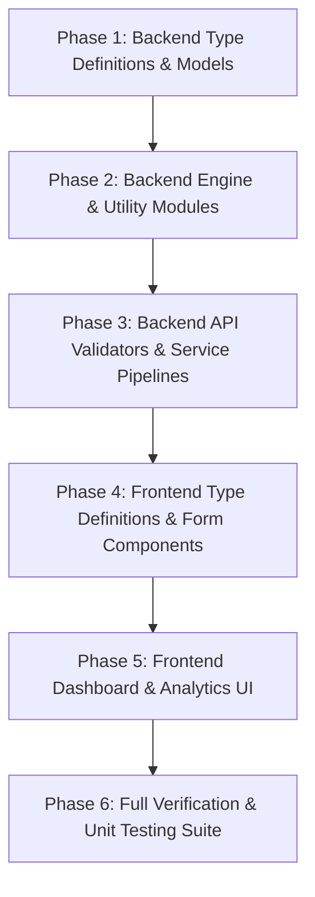

# Unified Pricing Variable Refactoring Specification & Implementation Roadmap

## Executive Overview
This specification details the end-to-end refactoring plan to standardize pricing terminology and variable naming conventions across the entire Accordo AI architecture (frontend, backend services, database models, API validators, and agentic AI engines).

The goal is to eliminate historical naming discrepancies (such as legacy per-unit references) and unify all price parameters under clear, unambiguous standards in a single, synchronized deployment.

---

## 1. Standardized Naming & Mapping Matrix

All occurrences across TypeScript interfaces, form schemas, database columns, API validators, and engine calculations will be refactored according to the following mapping rules:

| Legacy Variable / Label | New UI Display Label | New Backend Code Key (camelCase) | New Database / Snake Case Key |
| :--- | :--- | :--- | :--- |
| `targetUnitPrice` / `target_unit_price` | **Minimum Unit Price** | `minUnitPrice` | `min_unit_price` |
| `totalUnitPrice` / `total_price` (Target) | **Minimum Price (Total)** | `minTotalPrice` | `min_total_price` |
| `maxAcceptablePrice` / `max_acceptable_price` | **Maximum Unit Price** | `maxUnitPrice` | `max_unit_price` |
| `totalMaxAcceptablePrice` / `max_acceptable` | **Maximum Price (Total)** | `maxTotalPrice` | `max_total_price` |

---

## 2. Comprehensive Impact Audit By Subsystem

### 2.1 Frontend Application Layer (`Accordo-ai-frontend`)

#### A. Type Definitions & Contracts
* **`src/types/chatbot.ts`**: Update `WizardPriceQuantity` (lines 227, 505, 664, 974) to replace `targetUnitPrice` with `minUnitPrice` / `minTotalPrice`, and `maxAcceptablePrice` with `maxUnitPrice` / `maxTotalPrice`. Update `ParameterWeights` dictionary keys.

#### B. Deal Creation Wizard Components
* **`src/components/chatbot/deal-wizard/StepTwo.tsx`**: Update input field bindings, labels, error messages, and state update handlers (lines 384–410).
* **`src/components/chatbot/deal-wizard/StepFour.tsx`**: Update parameter weight keys (`minTotalPrice`, `maxTotalPrice`) and source definitions (lines 24–40).
* **`src/components/chatbot/deal-wizard/ReviewStep.tsx`**: Update confirmation summary cards (lines 235–245).
* **`src/components/requisition/DealWizardModal.tsx` & `StartDeals.tsx`**: Update payload mapping and validation handlers (lines 255–265, 375–390).
* **`src/pages/chatbot/NewDealPage.tsx`**: Update page-level form state and submit payloads (lines 805–820, 970–985).

#### C. Live Chat & Analytics UI
* **`src/pages/chatbot/NegotiationRoom.tsx`**: Update wizard config fallback resolution, weight aggregators, and parameter inputs (lines 610, 633, 676, 1510).
* **`src/components/chatbot/sidebar/parameterFormatter.ts`**: Update parameter label formatting dictionary.
* **`src/components/chatbot/ValueBreakdown.tsx`**: Update value breakdown parameter mappings.

---

### 2.2 Backend API & Validation Layer (`Accordo-ai-backend`)

#### A. Request Validation & Documentation
* **`src/modules/chatbot/chatbot.validator.ts`**: Update Joi schema validation rules (line 55) to validate `minTotalPrice` and `maxTotalPrice`.
* **`src/config/swagger.ts`**: Update OpenAPI request/response schema definitions.

#### B. Service & Mapping Pipelines
* **`src/modules/chatbot/chatbot.service.ts`**: Update wizard config extraction, bid analysis, contract generation, and fallback mappings (lines 288, 358, 665, 1190, 4591, 6677).
* **`src/modules/chatbot/convo/conversation-service.ts`**: Update stored config resolution, counter offer building, and trade-off calculators (lines 885, 1242–1246).
* **`src/modules/chatbot/prompts/procurement-manager-prompt.ts`**: Update LLM prompt engineering instructions and context variables.

---

### 2.3 Agentic Engine & Intelligence Layer (`Accordo-ai-backend/src/modules/chatbot/engine`)

#### A. Valuation & Utility Modules
* **`utility.ts`**: Update `NegotiationConfig.parameters` structure to use `min_total_price` and `max_total_price`.
* **`weighted-utility.ts`**: Update `calculatePriceUtility` and `calculateWeightedUtilityFromResolved` (lines 152, 184, 795, 984).
* **`value-function.ts`**: Update value function calculators and parameter impact lookup maps (lines 145, 304).

#### B. Strategy & Decision Engine
* **`decide.ts`**: Update `calculateDynamicCounter`, price ceiling guards, and concession algorithms to reference `min_total_price` and `max_total_price`.

---

### 2.4 Database Models & Persistence Layer (`Accordo-ai-backend/src/models` & `seeders`)

#### A. Sequelize ORM Models
* **`src/models/chatbot-deal.ts`**: Update JSONB getter/setter type annotations for `wizardConfig` and `negotiationConfig`.
* **`src/models/requisition.ts` & `requisition-product.ts`**: Update model declarations and column aliases (`minTotalPrice`, `maxTotalPrice`).
* **`src/models/deal-embedding.ts`**: Update field definitions for historical learning.

#### B. Database Seed Data
* **`src/seeders/data/contracts.ts`, `requisitions.ts`, `comprehensive-seed.ts`**: Update seed records to populate new keys natively.

---

## 3. Step-by-Step Implementation Roadmap

Execution will follow a strict, phased sequence to prevent intermediate breaking states:

1. **Phase 1: Backend Models & ORM Schema Updates**: Refactor Sequelize models and seeders to support new column aliases and JSON structures.
2. **Phase 2: Core Engine Refactoring**: Update `utility.ts`, `weighted-utility.ts`, `value-function.ts`, and `decide.ts` to use `min_total_price` and `max_total_price`.
3. **Phase 3: Service Layer & API Validators**: Update Joi validation schemas in `chatbot.validator.ts` and transformation logic in `chatbot.service.ts`.
4. **Phase 4: Frontend Types & Wizard Components**: Update `types/chatbot.ts`, `StepTwo.tsx`, `StepFour.tsx`, `ReviewStep.tsx`, and `DealWizardModal.tsx`.
5. **Phase 5: Frontend Dashboard & Real-Time Monitoring**: Update `NegotiationRoom.tsx`, `parameterFormatter.ts`, and analytics panels.
6. **Phase 6: Comprehensive Testing & Verification**: Execute `npm run test:unit` across the entire suite to guarantee 100% test passing and zero regressions.

---

## 4. Risk Mitigation & Verification Checkpoints

* **Backward Compatibility Guard**: Update service mapping functions to accept legacy payload keys temporarily if present, ensuring uninterrupted operations.
* **Database JSON Safety**: Provide dual-read fallback getters on `chatbot_deals.wizardConfig` so historical deals created before the refactoring continue to display correctly.
* **Automated Unit Test Verification**: Run all 1,264+ backend unit tests after each phase to verify mathematical integrity.
