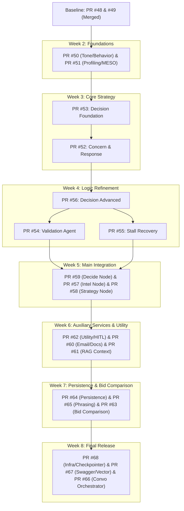

# Accordo AI: PR Sequential Merge Sequence Guide

This document outlines the **surgical, week-by-week sequential merge order** for the 18 open pull requests targeting the integration branch `epic/multi-agent-workflow`. Following this sequence ensures that dependencies are satisfied, test logic flows correctly, and merge conflicts are minimized.

---

## 1. Weekly Merge Progression Map



---

## 2. Step-by-Step Merge Sequence Table

To merge each PR, run the specified GitHub CLI command. **Wait for each PR to merge successfully before starting the next step.**

| Step | PR ID | Branch Name | Title / Deliverable | Dependencies | CLI Merge Command |
| :---: | :---: | :--- | :--- | :--- | :--- |
| **1** | **#50** | `yug/week1-2-analysis-agents` | Tone & Behavioral Analysis Agents | Baseline | `gh pr merge 50 --squash --delete-branch` |
| **2** | **#51** | `adarsh/week1-vendor-profiling` | Vendor Profiling & MESO Part 1 | Baseline | `gh pr merge 51 --squash --delete-branch` |
| **3** | **#53** | `vatsal/week3-decision-agent` | DecisionAgent Foundation | PR #50, #51 | `gh pr merge 53 --squash --delete-branch` |
| **4** | **#52** | `yug/week3-concerns-response` | Concern Extraction & Response Gen | **PR #53** | `gh pr merge 52 --squash --delete-branch` |
| **5** | **#56** | `vatsal/week4-decision-agent-advanced` | DecisionAgent Advanced | PR #52 | `gh pr merge 56 --squash --delete-branch` |
| **6** | **#54** | `yug/week4-validation-agent` | ValidationAgent (Output Safety) | **PR #56** | `gh pr merge 54 --squash --delete-branch` |
| **7** | **#55** | `adarsh/week4-stall-recovery` | StallRecoveryAgent | **PR #56** | `gh pr merge 55 --squash --delete-branch` |
| **8** | **#59** | `vatsal/week5-decision-node` | Main StateGraph Skeleton | PR #54, #55 | `gh pr merge 59 --squash --delete-branch` |
| **9** | **#57** | `yug/week5-intelligence-node` | Unified Intelligence Node | PR #59 | `gh pr merge 57 --squash --delete-branch` |
| **10** | **#58** | `adarsh/week5-strategy-node` | Strategy Offers Node | PR #59 | `gh pr merge 58 --squash --delete-branch` |
| **11** | **#62** | `vatsal/week6-utility-hitl` | Weighted Utility & HITL hooks | PR #57, #58 | `gh pr merge 62 --squash --delete-branch` |
| **12** | **#60** | `adarsh/week6-auxiliary-services` | Async Email & PDF Generation nodes | PR #62 | `gh pr merge 60 --squash --delete-branch` |
| **13** | **#61** | `yug/week6-rag-context-parallel` | RAG Context & Parallel execution | PR #62 | `gh pr merge 61 --squash --delete-branch` |
| **14** | **#64** | `vatsal/week7-persistence-tuning` | Checkpointer Optimizations | PR #60, #61 | `gh pr merge 64 --squash --delete-branch` |
| **15** | **#65** | `yug/week7-phrasing-safety` | Opener Dedup & Phrasing Safety | PR #60, #61 | `gh pr merge 65 --squash --delete-branch` |
| **16** | **#63** | `adarsh/week7-bid-comparison` | Multi-vendor Bid Comparison Node | PR #60, #61 | `gh pr merge 63 --squash --delete-branch` |
| **17** | **#68** | `vatsal/week8-infra-update` | Dockerfile & checkpointer fallback | PR #64, #65, #63 | `gh pr merge 68 --squash --delete-branch` |
| **18** | **#67** | `yug/week8-api-docs` | Swagger documentation & Vector API | PR #64, #65, #63 | `gh pr merge 67 --squash --delete-branch` |
| **19** | **#66** | `adarsh/week8-convo-orchestration` | Turn execution & Orchestrator entry | PR #68, #67 | `gh pr merge 66 --squash --delete-branch` |

---

## 3. Best Practices for Resolving Merge Conflicts

Because these branches represent successive phases of a single codebase, you might encounter conflicts as you move from week to week. 

### Recommended Local Sync Workflow:
If GitHub blocks a PR from merging due to conflicts (e.g., in Step 5 for PR #56):
1. **Pull the latest `epic/multi-agent-workflow`**:
   ```bash
   git checkout epic/multi-agent-workflow
   git pull origin epic/multi-agent-workflow
   ```
2. **Switch to the conflicting branch**:
   ```bash
   git checkout vatsal/week4-decision-agent-advanced
   ```
3. **Merge `epic/multi-agent-workflow` locally**:
   ```bash
   git merge epic/multi-agent-workflow
   ```
4. **Resolve conflicts**:
   - Open conflicted files, keep changes from both where applicable (since they represent different track tasks), and save.
   - Run tests: `NODE_OPTIONS="--max-old-space-size=4096" npx vitest run` to verify the merge didn't break functionality.
5. **Commit and Push**:
   ```bash
   git add .
   git commit -m "merge: sync with epic/multi-agent-workflow to resolve conflicts"
   git push origin vatsal/week4-decision-agent-advanced
   ```
6. **Complete the merge on GitHub**:
   The PR on GitHub will now show green and can be safely merged using `gh pr merge 56 --squash --delete-branch`.
